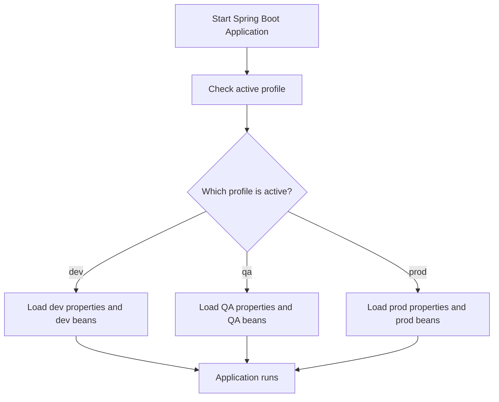
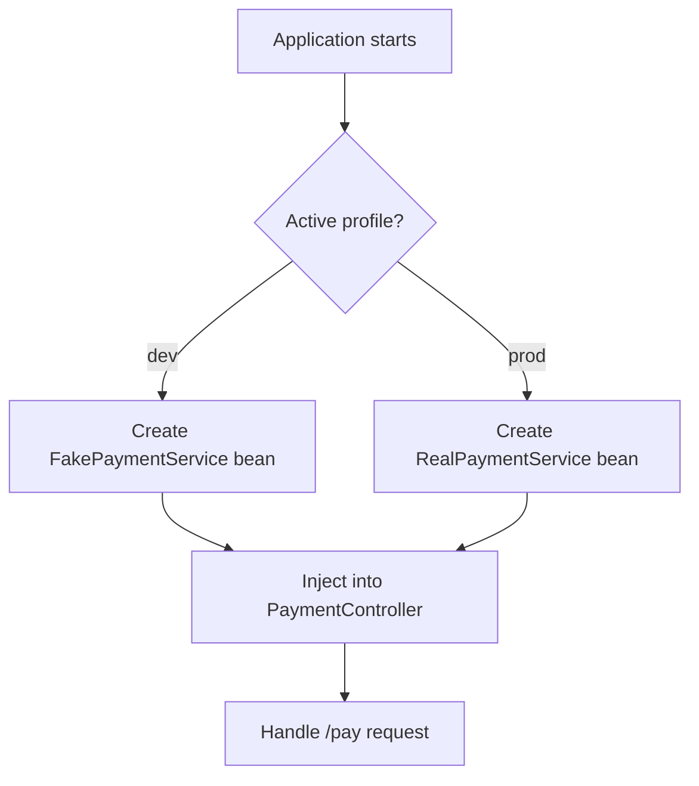
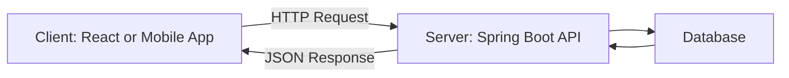
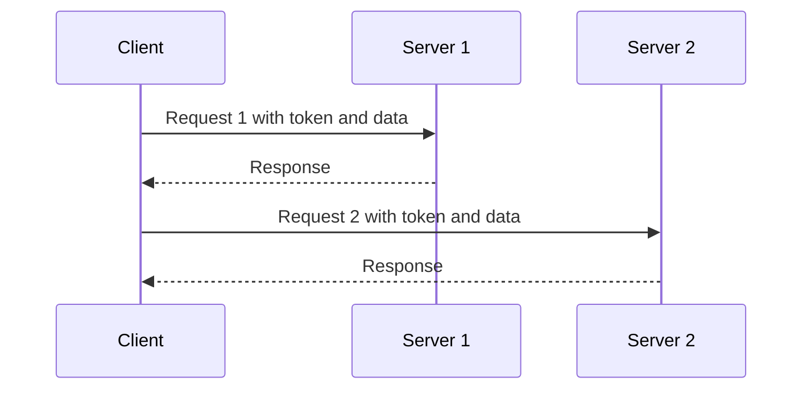
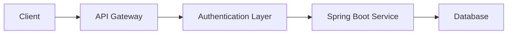
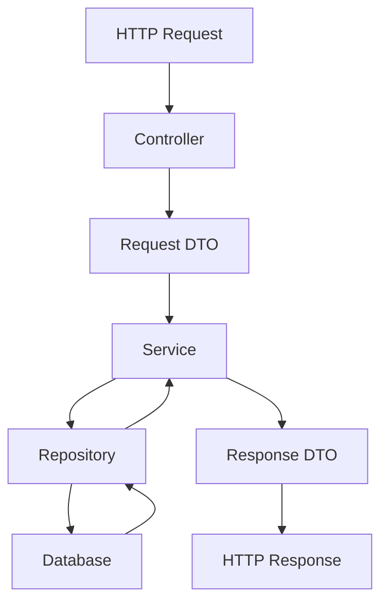
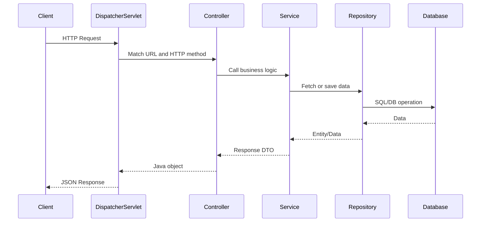

# <span style="color:#0B5FFF">Spring Profiles and Spring REST API - README</span>

This README explains **Spring Profiles** and **Spring REST API** in a simple, practical way with examples, flow diagrams, and interview-style explanation points.

---

## <span style="color:#2E7D32">Table of Contents</span>

1. [Spring Profiles](#spring-profiles)
2. [How to set profiles](#how-to-set-profiles)
3. [How to create beans for specific environments](#how-to-create-beans-for-specific-environments)
4. [Spring REST](#spring-rest)
5. [REST architectural principles](#rest-architectural-principles)
6. [REST API design standards](#rest-api-design-standards)
7. [Spring REST annotations with examples](#spring-rest-annotations-with-examples)
8. [RequestParam vs PathVariable](#requestparam-vs-pathvariable)
9. [Complete mini example](#complete-mini-example)
10. [Interview quick revision](#interview-quick-revision)

---

# <span style="color:#C2185B">1. Spring Profiles</span>

## What is a Spring Profile?

A **Spring Profile** is a way to tell Spring Boot:

> “Run this application using a specific environment configuration.”

In real projects, we usually have different environments:

- `dev` - developer local system
- `test` - testing environment
- `qa` - QA team environment
- `uat` - user acceptance testing
- `prod` - production/live environment

Each environment may use different values:

| Environment | Database | Logging | Payment Gateway | Email Service |
|---|---|---|---|---|
| dev | local DB | detailed logs | fake payment | fake email |
| qa | QA DB | medium logs | sandbox payment | test email |
| prod | production DB | limited logs | real payment | real email |

## Simple explanation with example

Think of your application like a school bag.

For school, you pack books.  
For sports, you pack shoes.  
For travel, you pack clothes.

The bag is the same, but the items change based on where you are going.

Spring Profile works the same way. The application is the same, but the configuration changes based on where it is running.

## Why do we use Spring Profiles?

We use Spring Profiles to avoid changing code for every environment.

Without profiles, developers may manually change database URLs, passwords, logging levels, or service URLs before deploying. That is risky.

With profiles, we keep separate configuration and activate the correct one.

## Common uses

- Use local database in development.
- Use production database only in production.
- Use fake email service in development.
- Use real email service in production.
- Enable detailed logging in development.
- Disable sensitive debug logs in production.
- Create different beans for different environments.

## Profile flow diagram



---

# <span style="color:#C2185B">2. How to set profiles</span>

## 2.1 Set profile while running from IntelliJ IDEA

### Option 1: Active profiles field

In IntelliJ IDEA:

1. Open **Run/Debug Configurations**.
2. Select your Spring Boot application.
3. Find **Active profiles**.
4. Enter the profile name:

```text
dev
```

or multiple profiles:

```text
dev,local
```

Then run the application.

## Simple explanation with example

You are telling IntelliJ:

> “When you start this app, start it as dev environment.”

## Option 2: Program arguments

You can also add this in **Program arguments**:

```bash
--spring.profiles.active=dev
```

For multiple profiles:

```bash
--spring.profiles.active=dev,local
```

## Option 3: VM options

You can add this in **VM options**:

```bash
-Dspring.profiles.active=dev
```

## Option 4: Environment variable

You can set an environment variable:

```bash
SPRING_PROFILES_ACTIVE=dev
```

## Which one should we use?

| Situation | Best option |
|---|---|
| Running locally in IntelliJ | Active profiles field |
| Running from command line | `--spring.profiles.active=dev` |
| Running in Docker/Kubernetes/cloud | Environment variable |
| Temporary local override | Program arguments |

---

## 2.2 Set profile from `application.yml`

You can set the active profile directly inside `application.yml`.

```yaml
spring:
  profiles:
    active: dev
```

This means Spring Boot will activate the `dev` profile when the application starts.

## Example: One `application.yml` with multiple profile sections

```yaml
spring:
  profiles:
    active: dev

app:
  name: Student Service

---
spring:
  config:
    activate:
      on-profile: dev

server:
  port: 8081

app:
  database-name: local_student_db
  email-provider: fake-email

---
spring:
  config:
    activate:
      on-profile: prod

server:
  port: 8080

app:
  database-name: prod_student_db
  email-provider: real-email
```

## Simple explanation with example

This file says:

- Common values are at the top.
- If profile is `dev`, use the dev section.
- If profile is `prod`, use the prod section.

## Important note

Do not put `spring.profiles.active` inside a profile-specific section.

This is wrong:

```yaml
spring:
  config:
    activate:
      on-profile: prod
  profiles:
    active: qa
```

Why? Because Spring is already inside a profile-specific section. Setting another active profile from there creates confusing behavior.

---

## 2.3 Profile-specific files

Instead of keeping everything in one file, we can create separate files.

```text
src/main/resources
 ├── application.yml
 ├── application-dev.yml
 ├── application-qa.yml
 └── application-prod.yml
```

### application.yml

```yaml
spring:
  profiles:
    active: dev

app:
  name: Student Service
```

### application-dev.yml

```yaml
server:
  port: 8081

app:
  database-name: local_student_db
  email-provider: fake-email
```

### application-prod.yml

```yaml
server:
  port: 8080

app:
  database-name: prod_student_db
  email-provider: real-email
```

## When to use this approach

Use separate files when each environment has many different properties.

For example:

- Database URL
- Redis URL
- Kafka topic
- Logging level
- External API URL
- Email provider
- Payment gateway

---

## 2.4 Set profile programmatically

You can also set profiles using Java code.

### Example using `SpringApplication`

```java
import org.springframework.boot.SpringApplication;
import org.springframework.boot.autoconfigure.SpringBootApplication;

@SpringBootApplication
public class StudentApplication {

    public static void main(String[] args) {
        SpringApplication app = new SpringApplication(StudentApplication.class);
        app.setAdditionalProfiles("dev");
        app.run(args);
    }
}
```

## Simple explanation with example

Here we are telling Spring Boot through Java code:

> “Before starting the app, also use the dev profile.”

## Example using `SpringApplicationBuilder`

```java
import org.springframework.boot.autoconfigure.SpringBootApplication;
import org.springframework.boot.builder.SpringApplicationBuilder;

@SpringBootApplication
public class StudentApplication {

    public static void main(String[] args) {
        new SpringApplicationBuilder(StudentApplication.class)
                .profiles("dev")
                .run(args);
    }
}
```

## When to use programmatic profile setting

Use this rarely.

It can be useful when:

- You are writing tests.
- You are building internal tools.
- You need to decide profile based on some startup logic.

## Drawback

Programmatic profile setting can make deployment confusing because the profile is hidden inside Java code. In real projects, environment variables or command-line arguments are usually better.

---

# <span style="color:#C2185B">3. How to create beans for specific environments</span>

## What does this mean?

Sometimes we want one bean in development and another bean in production.

Example:

- In `dev`, use fake payment service.
- In `prod`, use real payment service.

## 3.1 Bean only for a specific profile using `@Profile`

### PaymentService interface

```java
public interface PaymentService {
    String pay(double amount);
}
```

### Dev bean

```java
import org.springframework.context.annotation.Profile;
import org.springframework.stereotype.Service;

@Service
@Profile("dev")
public class FakePaymentService implements PaymentService {

    @Override
    public String pay(double amount) {
        return "Fake payment successful for amount: " + amount;
    }
}
```

### Prod bean

```java
import org.springframework.context.annotation.Profile;
import org.springframework.stereotype.Service;

@Service
@Profile("prod")
public class RealPaymentService implements PaymentService {

    @Override
    public String pay(double amount) {
        return "Real payment successful for amount: " + amount;
    }
}
```

### Controller using the bean

```java
import org.springframework.web.bind.annotation.GetMapping;
import org.springframework.web.bind.annotation.RequestParam;
import org.springframework.web.bind.annotation.RestController;

@RestController
public class PaymentController {

    private final PaymentService paymentService;

    public PaymentController(PaymentService paymentService) {
        this.paymentService = paymentService;
    }

    @GetMapping("/pay")
    public String pay(@RequestParam double amount) {
        return paymentService.pay(amount);
    }
}
```

## What happens here?

If active profile is `dev`, Spring creates `FakePaymentService`.

If active profile is `prod`, Spring creates `RealPaymentService`.

The controller does not care which one is used. Spring injects the correct one.

## Flow diagram



---

## 3.2 `@Profile` at class level

You can place `@Profile` on a class.

```java
import org.springframework.context.annotation.Configuration;
import org.springframework.context.annotation.Profile;

@Configuration
@Profile("prod")
public class ProductionConfig {

    // Beans inside this class load only when prod profile is active
}
```

## Simple explanation with example

This means:

> “Use this whole configuration class only in production.”

## When to use class-level `@Profile`

Use it when the full class belongs to one environment.

Example:

- `ProductionSecurityConfig`
- `DevDatabaseConfig`
- `LocalCacheConfig`

---

## 3.3 `@Profile` at method level with `@Bean`

```java
import org.springframework.context.annotation.Bean;
import org.springframework.context.annotation.Configuration;
import org.springframework.context.annotation.Profile;

@Configuration
public class EmailConfig {

    @Bean
    @Profile("dev")
    public EmailService fakeEmailService() {
        return new FakeEmailService();
    }

    @Bean
    @Profile("prod")
    public EmailService realEmailService() {
        return new RealEmailService();
    }
}
```

## When to use method-level `@Profile`

Use it when only some beans inside a configuration class are profile-specific.

---

## 3.4 Profile expressions

Spring also supports profile expressions.

```java
@Profile("dev")
```

Only for dev.

```java
@Profile("!prod")
```

For every profile except prod.

```java
@Profile({"dev", "qa"})
```

For dev or QA.

## Drawback

Do not overuse complex profile expressions. They can make the application harder to understand.

---

# <span style="color:#1565C0">4. Spring REST</span>

## What is a REST API?

A **REST API** is a way for two applications to communicate using HTTP.

Example:

- React app asks Spring Boot for student data.
- Spring Boot receives the request.
- Spring Boot returns data as JSON.

```text
React UI  --->  HTTP Request  --->  Spring Boot REST API
React UI  <---  JSON Response  <---  Spring Boot REST API
```

## Simple explanation with example

Imagine a restaurant.

You are the client.  
The kitchen is the server.  
The menu is the API.  
You order food using menu items.  
The kitchen gives you food.

In software:

- Client asks for data.
- Server processes the request.
- Server sends response.

## Example REST API endpoint

```http
GET /api/students/101
```

Response:

```json
{
  "id": 101,
  "name": "Rahul",
  "course": "Java"
}
```

---

# <span style="color:#1565C0">5. REST architectural principles</span>

REST has architectural principles. These are rules that help APIs stay simple, scalable, and easy to understand.

---

## 5.1 Client-server architecture

## Definition

Client-server architecture means the client and server have separate responsibilities.

| Part | Responsibility |
|---|---|
| Client | UI, user interaction, displaying data |
| Server | Business logic, database, security, APIs |

## Example

```text
Browser / React / Angular / Mobile App = Client
Spring Boot API + Database = Server
```

## Flow diagram



## Why it is used

- Frontend and backend can be developed separately.
- Mobile app, web app, and other systems can use the same backend.
- Backend can be secured and scaled separately.

## Drawback

Network calls take time. If the backend is slow, the frontend feels slow.

---

## 5.2 Why REST is stateless

## Definition

REST is stateless because every request should contain all the information needed to process it.

The server should not depend on previous requests to understand the current request.

## Example

Good stateless request:

```http
GET /api/orders/1001
Authorization: Bearer jwt-token
```

The request contains:

- Which order is needed: `1001`
- Who is asking: JWT token

The server can process it without remembering previous requests.

## Simple explanation with example

Imagine a teacher checks each homework sheet separately.

Each sheet must have:

- Student name
- Class
- Answers

The teacher should not need to remember what the student said yesterday.

That is stateless.

## Why stateless is useful

- Easy to scale with multiple servers.
- Any server can handle any request.
- Better for cloud deployment.
- Reduces server memory usage.

## Stateless flow



Both servers can process requests because the needed information is sent in each request.

## Drawback

The client must send required information every time, such as token, request body, or identifiers.

---

## 5.3 Cacheable in REST

## Definition

Cacheable means a response can be stored and reused for some time.

Example:

```http
GET /api/products/10
```

If product details do not change often, the response can be cached.

## Why it is used

- Improves performance.
- Reduces server load.
- Reduces database calls.
- Makes repeated requests faster.

## Example response header

```http
Cache-Control: max-age=3600
```

This means the response can be cached for 3600 seconds.

## Spring Boot example

```java
import org.springframework.http.CacheControl;
import org.springframework.http.ResponseEntity;
import org.springframework.web.bind.annotation.GetMapping;
import org.springframework.web.bind.annotation.PathVariable;
import org.springframework.web.bind.annotation.RestController;

import java.util.concurrent.TimeUnit;

@RestController
public class ProductController {

    @GetMapping("/api/products/{id}")
    public ResponseEntity<String> getProduct(@PathVariable Long id) {
        return ResponseEntity.ok()
                .cacheControl(CacheControl.maxAge(1, TimeUnit.HOURS))
                .body("Product id: " + id);
    }
}
```

## Drawback

If cache is not handled properly, users may see old data.

---

## 5.4 Layered system in REST

## Definition

Layered system means the client does not need to know whether it is talking directly to the main server or through other layers.

Common layers:

- Load balancer
- API gateway
- Authentication server
- Cache server
- Backend service
- Database

## Flow diagram



## Why it is used

- Improves security.
- Helps scaling.
- Allows common logging and monitoring.
- Allows API gateway routing.

## Drawback

Too many layers can increase latency and make debugging harder.

---

## 5.5 Code on demand

## Definition

Code on demand means the server can send executable code to the client when needed.

Example:

- Browser downloads JavaScript from the server.
- Browser executes that JavaScript.

## Important point

Code on demand is optional in REST. Most Spring Boot REST APIs do not depend on this principle directly.

## Simple explanation with example

Instead of giving only data, the server can also give small instructions/code that the client can run.

## Drawback

It can reduce visibility and increase security risk if not controlled carefully.

---

## 5.6 Uniform interface

## Definition

Uniform interface means every REST API should follow a consistent and standard way of communication.

In simple words:

> Use URLs, HTTP methods, request bodies, response bodies, and status codes in a predictable way.

## Four guiding principles of uniform interface

### 1. Identification of resources

Every resource should have a clear URL.

```http
/api/students
/api/students/101
/api/courses/5
```

A resource is a thing, usually a noun.

Good:

```http
/api/students/101
```

Avoid:

```http
/api/getStudentById/101
```

---

### 2. Manipulation of resources through representations

Client and server exchange resource representations, usually JSON.

Example request:

```http
POST /api/students
Content-Type: application/json
```

```json
{
  "name": "Rahul",
  "course": "Java"
}
```

The JSON is a representation of the student resource.

---

### 3. Self-descriptive messages

Each request and response should clearly describe itself.

Example:

```http
Content-Type: application/json
Authorization: Bearer token
```

This tells the server:

- Data format is JSON.
- User authorization is provided.

---

### 4. Hypermedia as the engine of application state, HATEOAS

The response can include links that tell the client what it can do next.

Example:

```json
{
  "id": 101,
  "name": "Rahul",
  "links": {
    "self": "/api/students/101",
    "courses": "/api/students/101/courses"
  }
}
```

## Simple explanation with example

Like a website page has links to the next page, a REST API response can also include links to related actions.

## Important practical note

Many real Spring Boot APIs follow REST resource design but do not fully implement HATEOAS. That is common in industry, but in interviews you should know that HATEOAS is part of strict REST.

---

# <span style="color:#1565C0">6. Web architectural principles</span>

## 6.1 Unique identification of resources

Every resource should have a unique URL.

```http
/api/books/10
/api/customers/25
/api/orders/5001
```

## 6.2 Different resource representations

The same resource can be represented in different formats.

Common format:

```json
{
  "id": 10,
  "title": "Spring Boot Basics"
}
```

Other possible formats:

- XML
- HTML
- CSV

In modern REST APIs, JSON is most common.

## 6.3 Hypermedia/linking of resources

Resources can link to related resources.

Example:

```json
{
  "orderId": 5001,
  "customer": "/api/customers/25",
  "items": "/api/orders/5001/items"
}
```

## 6.4 Stateless communication

Each request should carry enough data for the server to process it.

## 6.5 Standard methods

Use standard HTTP methods.

| HTTP Method | Purpose | Example |
|---|---|---|
| GET | Read data | `GET /api/students/101` |
| POST | Create new data | `POST /api/students` |
| PUT | Replace/update full resource | `PUT /api/students/101` |
| PATCH | Partially update resource | `PATCH /api/students/101` |
| DELETE | Delete resource | `DELETE /api/students/101` |

---

# <span style="color:#1565C0">7. REST API design standards</span>

## 7.1 Resource design

Use nouns, not verbs.

Good:

```http
GET /api/students
POST /api/students
GET /api/students/101
PUT /api/students/101
DELETE /api/students/101
```

Avoid:

```http
GET /api/getStudents
POST /api/createStudent
PUT /api/updateStudent/101
DELETE /api/deleteStudent/101
```

Why?

Because HTTP methods already describe the action.

---

## 7.2 Use plural resource names

Good:

```http
/api/students
/api/orders
/api/products
```

Avoid:

```http
/api/student
/api/order
/api/product
```

Plural names are commonly used because the endpoint represents a collection.

---

## 7.3 Use proper status codes

### 1xx - Informational

Rarely used directly in normal Spring Boot CRUD APIs.

Example:

```text
100 Continue
```

### 2xx - Success

| Status | Meaning | When to use |
|---|---|---|
| 200 OK | Request successful | GET, PUT, PATCH success |
| 201 Created | New resource created | POST success |
| 204 No Content | Success but no response body | DELETE success |

### 3xx - Redirection

| Status | Meaning |
|---|---|
| 301 Moved Permanently | Resource moved permanently |
| 302 Found | Temporary redirect |
| 304 Not Modified | Cached version can be used |

### 4xx - Client error

| Status | Meaning | Example |
|---|---|---|
| 400 Bad Request | Invalid request data | Missing required field |
| 401 Unauthorized | Not logged in or invalid token | No JWT token |
| 403 Forbidden | Logged in but no permission | Employee accessing admin API |
| 404 Not Found | Resource not found | Student id does not exist |
| 409 Conflict | Duplicate/conflict | Email already exists |

### 5xx - Server error

| Status | Meaning | Example |
|---|---|---|
| 500 Internal Server Error | Unexpected server issue | NullPointerException |
| 502 Bad Gateway | Gateway received bad response | API gateway issue |
| 503 Service Unavailable | Service temporarily unavailable | Database down |

---

## 7.4 Use clear request and response models

Avoid exposing entity classes directly in large projects. Use DTOs.

```text
Controller receives Request DTO
Controller returns Response DTO
Service handles business logic
Repository talks to database
```

## Flow diagram



---

# <span style="color:#6A1B9A">8. Spring REST annotations with examples</span>

## 8.1 `@RestController`

## Definition

`@RestController` is used to create REST API controllers.

It is a combination of:

- `@Controller`
- `@ResponseBody`

This means methods return data directly as JSON/XML response instead of returning a view page.

## Example

```java
import org.springframework.web.bind.annotation.GetMapping;
import org.springframework.web.bind.annotation.RestController;

@RestController
public class HelloController {

    @GetMapping("/hello")
    public String hello() {
        return "Hello Spring REST";
    }
}
```

Output:

```text
Hello Spring REST
```

---

## 8.2 `@GetMapping`

## Definition

`@GetMapping` is used to read data.

## Example

```java
@GetMapping("/api/students/{id}")
public String getStudent(@PathVariable Long id) {
    return "Student id is " + id;
}
```

Request:

```http
GET /api/students/101
```

Response:

```text
Student id is 101
```

## When to use

Use `GET` when you want to retrieve data and not change anything in the server.

---

## 8.3 `@PostMapping`

## Definition

`@PostMapping` is used to create new data.

## Example

```java
@PostMapping("/api/students")
@ResponseStatus(HttpStatus.CREATED)
public StudentResponse createStudent(@RequestBody StudentRequest request) {
    return new StudentResponse(101L, request.getName(), request.getCourse());
}
```

Request:

```http
POST /api/students
Content-Type: application/json
```

```json
{
  "name": "Rahul",
  "course": "Java"
}
```

Response status:

```text
201 Created
```

## When to use

Use `POST` when creating a new resource.

---

## 8.4 `@PutMapping`

## Definition

`@PutMapping` is used to update/replace an existing resource.

## Example

```java
@PutMapping("/api/students/{id}")
public StudentResponse updateStudent(
        @PathVariable Long id,
        @RequestBody StudentRequest request) {

    return new StudentResponse(id, request.getName(), request.getCourse());
}
```

Request:

```http
PUT /api/students/101
Content-Type: application/json
```

```json
{
  "name": "Rahul Kumar",
  "course": "Spring Boot"
}
```

## When to use

Use `PUT` when updating the full resource.

---

## 8.5 `@PatchMapping`

## Definition

`@PatchMapping` is used to update only part of a resource.

## Example

```java
@PatchMapping("/api/students/{id}/course")
public String updateCourse(@PathVariable Long id, @RequestParam String course) {
    return "Updated student " + id + " course to " + course;
}
```

Request:

```http
PATCH /api/students/101/course?course=SpringBoot
```

## When to use

Use `PATCH` when only one or a few fields are changing.

---

## 8.6 `@DeleteMapping`

## Definition

`@DeleteMapping` is used to delete data.

## Example

```java
@DeleteMapping("/api/students/{id}")
@ResponseStatus(HttpStatus.NO_CONTENT)
public void deleteStudent(@PathVariable Long id) {
    // delete student by id
}
```

Response:

```text
204 No Content
```

---

## 8.7 `@ResponseStatus`

## Definition

`@ResponseStatus` tells Spring which HTTP status code to return.

## Example for successful creation

```java
@PostMapping("/api/students")
@ResponseStatus(HttpStatus.CREATED)
public StudentResponse createStudent(@RequestBody StudentRequest request) {
    return new StudentResponse(101L, request.getName(), request.getCourse());
}
```

This returns:

```text
201 Created
```

## Example for custom exception

```java
import org.springframework.http.HttpStatus;
import org.springframework.web.bind.annotation.ResponseStatus;

@ResponseStatus(HttpStatus.NOT_FOUND)
public class StudentNotFoundException extends RuntimeException {

    public StudentNotFoundException(Long id) {
        super("Student not found with id: " + id);
    }
}
```

Usage:

```java
@GetMapping("/api/students/{id}")
public StudentResponse getStudent(@PathVariable Long id) {
    if (id == 999) {
        throw new StudentNotFoundException(id);
    }
    return new StudentResponse(id, "Rahul", "Java");
}
```

If student is not found, response status becomes:

```text
404 Not Found
```

## When to use `@ResponseStatus`

Use it when a method or exception always returns the same status.

## Drawback

For complex APIs, `ResponseEntity` is more flexible because you can control status, headers, and body dynamically.

---

## 8.8 `@RequestParam`

## Definition

`@RequestParam` reads data from query parameters in the URL.

## Example

```java
@GetMapping("/api/students")
public String getStudentsByCourse(@RequestParam String course) {
    return "Students for course: " + course;
}
```

Request:

```http
GET /api/students?course=Java
```

Response:

```text
Students for course: Java
```

## Optional request parameter

```java
@GetMapping("/api/students/search")
public String searchStudents(
        @RequestParam(required = false) String name,
        @RequestParam(defaultValue = "0") int page,
        @RequestParam(defaultValue = "10") int size) {

    return "name=" + name + ", page=" + page + ", size=" + size;
}
```

Request:

```http
GET /api/students/search?name=Rahul&page=1&size=5
```

## When to use

Use `@RequestParam` for:

- Filtering
- Searching
- Sorting
- Pagination
- Optional values

Examples:

```http
/api/products?category=mobile
/api/orders?status=PAID
/api/students?page=0&size=10
```

---

## 8.9 `@PathVariable`

## Definition

`@PathVariable` reads data from the URL path.

## Example

```java
@GetMapping("/api/students/{id}")
public String getStudent(@PathVariable Long id) {
    return "Student id: " + id;
}
```

Request:

```http
GET /api/students/101
```

Response:

```text
Student id: 101
```

## When to use

Use `@PathVariable` when the value identifies a specific resource.

Examples:

```http
/api/students/101
/api/orders/5001
/api/products/20
```

---

## 8.10 `@JsonProperty`

## Definition

`@JsonProperty` is used to map JSON field names to Java variable names.

## Why it is used

Sometimes JSON naming and Java naming are different.

Example JSON:

```json
{
  "student_name": "Rahul",
  "course_name": "Java"
}
```

Java usually uses camelCase:

```java
private String studentName;
private String courseName;
```

`@JsonProperty` connects them.

## Example

```java
import com.fasterxml.jackson.annotation.JsonProperty;

public class StudentRequest {

    @JsonProperty("student_name")
    private String studentName;

    @JsonProperty("course_name")
    private String courseName;

    public String getStudentName() {
        return studentName;
    }

    public void setStudentName(String studentName) {
        this.studentName = studentName;
    }

    public String getCourseName() {
        return courseName;
    }

    public void setCourseName(String courseName) {
        this.courseName = courseName;
    }
}
```

Now this JSON works:

```json
{
  "student_name": "Rahul",
  "course_name": "Java"
}
```

## When to use

Use `@JsonProperty` when:

- API field names are snake_case.
- Java fields are camelCase.
- You want to expose a different JSON name.
- You are integrating with third-party APIs.

---

## 8.11 Importance of getters, setters, and `toString()`

## Getters

Getters help Java frameworks read object values.

```java
public String getName() {
    return name;
}
```

Spring/Jackson can use getters while converting Java object to JSON.

## Setters

Setters help Java frameworks set object values.

```java
public void setName(String name) {
    this.name = name;
}
```

When a POST request sends JSON, Jackson creates a Java object and sets values using setters or fields/constructors.

## `toString()`

`toString()` helps with debugging and logging.

```java
@Override
public String toString() {
    return "StudentRequest{name='" + name + "', course='" + course + "'}";
}
```

Example:

```java
@PostMapping("/api/students")
public String createStudent(@RequestBody StudentRequest request) {
    System.out.println(request);
    return "Student created";
}
```

Without `toString()`, logs may show something like:

```text
StudentRequest@5f8ed237
```

With `toString()`, logs are readable:

```text
StudentRequest{name='Rahul', course='Java'}
```

## Best practice

In real projects, many teams use Lombok to reduce boilerplate:

```java
import lombok.Data;

@Data
public class StudentRequest {
    private String name;
    private String course;
}
```

`@Data` generates getters, setters, `toString()`, and more.

## Drawback

Be careful with `toString()` on sensitive fields like password, token, SSN, or card number. Do not log sensitive data.

---

# <span style="color:#6A1B9A">9. RequestParam vs PathVariable</span>

## Main difference

| Topic | `@PathVariable` | `@RequestParam` |
|---|---|---|
| Where value comes from | URL path | Query string |
| Used for | Identifying a resource | Filtering/searching/sorting/pagination |
| Example URL | `/api/students/101` | `/api/students?course=Java` |
| Required usually? | Usually required | Can be optional |
| Best use | Specific student/order/product | List/search/filter data |

## `@PathVariable` example

```java
@GetMapping("/api/students/{id}")
public String getStudent(@PathVariable Long id) {
    return "Student id: " + id;
}
```

Request:

```http
GET /api/students/101
```

Use this when `101` is the identity of the student.

---

## `@RequestParam` example

```java
@GetMapping("/api/students")
public String getStudents(@RequestParam String course) {
    return "Course: " + course;
}
```

Request:

```http
GET /api/students?course=Java
```

Use this when `course=Java` is a filter.

---

## Easy rule

Ask this question:

> Is this value identifying one exact resource?

If yes, use `@PathVariable`.

```http
/api/students/101
```

If the value is used to filter, search, sort, or paginate, use `@RequestParam`.

```http
/api/students?course=Java&page=0&size=10
```

---

# <span style="color:#EF6C00">10. Complete mini example</span>

This example shows a simple Student REST API.

## Project structure

```text
src/main/java/com/example/student
 ├── StudentApplication.java
 ├── controller
 │    └── StudentController.java
 ├── dto
 │    ├── StudentRequest.java
 │    └── StudentResponse.java
 ├── exception
 │    └── StudentNotFoundException.java
 └── service
      └── StudentService.java
```

---

## StudentApplication.java

```java
package com.example.student;

import org.springframework.boot.SpringApplication;
import org.springframework.boot.autoconfigure.SpringBootApplication;

@SpringBootApplication
public class StudentApplication {

    public static void main(String[] args) {
        SpringApplication.run(StudentApplication.class, args);
    }
}
```

---

## StudentRequest.java

```java
package com.example.student.dto;

import com.fasterxml.jackson.annotation.JsonProperty;

public class StudentRequest {

    @JsonProperty("student_name")
    private String name;

    @JsonProperty("course_name")
    private String course;

    public StudentRequest() {
    }

    public StudentRequest(String name, String course) {
        this.name = name;
        this.course = course;
    }

    public String getName() {
        return name;
    }

    public void setName(String name) {
        this.name = name;
    }

    public String getCourse() {
        return course;
    }

    public void setCourse(String course) {
        this.course = course;
    }

    @Override
    public String toString() {
        return "StudentRequest{" +
                "name='" + name + '\'' +
                ", course='" + course + '\'' +
                '}';
    }
}
```

---

## StudentResponse.java

```java
package com.example.student.dto;

public class StudentResponse {

    private Long id;
    private String name;
    private String course;

    public StudentResponse() {
    }

    public StudentResponse(Long id, String name, String course) {
        this.id = id;
        this.name = name;
        this.course = course;
    }

    public Long getId() {
        return id;
    }

    public void setId(Long id) {
        this.id = id;
    }

    public String getName() {
        return name;
    }

    public void setName(String name) {
        this.name = name;
    }

    public String getCourse() {
        return course;
    }

    public void setCourse(String course) {
        this.course = course;
    }
}
```

---

## StudentNotFoundException.java

```java
package com.example.student.exception;

import org.springframework.http.HttpStatus;
import org.springframework.web.bind.annotation.ResponseStatus;

@ResponseStatus(HttpStatus.NOT_FOUND)
public class StudentNotFoundException extends RuntimeException {

    public StudentNotFoundException(Long id) {
        super("Student not found with id: " + id);
    }
}
```

---

## StudentService.java

```java
package com.example.student.service;

import com.example.student.dto.StudentRequest;
import com.example.student.dto.StudentResponse;
import com.example.student.exception.StudentNotFoundException;
import org.springframework.stereotype.Service;

import java.util.ArrayList;
import java.util.List;

@Service
public class StudentService {

    private final List<StudentResponse> students = new ArrayList<>();

    public StudentService() {
        students.add(new StudentResponse(1L, "Rahul", "Java"));
        students.add(new StudentResponse(2L, "Priya", "Spring Boot"));
    }

    public List<StudentResponse> getAllStudents(String course) {
        if (course == null || course.isBlank()) {
            return students;
        }

        return students.stream()
                .filter(student -> student.getCourse().equalsIgnoreCase(course))
                .toList();
    }

    public StudentResponse getStudentById(Long id) {
        return students.stream()
                .filter(student -> student.getId().equals(id))
                .findFirst()
                .orElseThrow(() -> new StudentNotFoundException(id));
    }

    public StudentResponse createStudent(StudentRequest request) {
        Long newId = students.size() + 1L;
        StudentResponse response = new StudentResponse(newId, request.getName(), request.getCourse());
        students.add(response);
        return response;
    }

    public StudentResponse updateStudent(Long id, StudentRequest request) {
        StudentResponse existingStudent = getStudentById(id);
        existingStudent.setName(request.getName());
        existingStudent.setCourse(request.getCourse());
        return existingStudent;
    }

    public void deleteStudent(Long id) {
        StudentResponse existingStudent = getStudentById(id);
        students.remove(existingStudent);
    }
}
```

---

## StudentController.java

```java
package com.example.student.controller;

import com.example.student.dto.StudentRequest;
import com.example.student.dto.StudentResponse;
import com.example.student.service.StudentService;
import org.springframework.http.HttpStatus;
import org.springframework.web.bind.annotation.DeleteMapping;
import org.springframework.web.bind.annotation.GetMapping;
import org.springframework.web.bind.annotation.PathVariable;
import org.springframework.web.bind.annotation.PostMapping;
import org.springframework.web.bind.annotation.PutMapping;
import org.springframework.web.bind.annotation.RequestBody;
import org.springframework.web.bind.annotation.RequestMapping;
import org.springframework.web.bind.annotation.RequestParam;
import org.springframework.web.bind.annotation.ResponseStatus;
import org.springframework.web.bind.annotation.RestController;

import java.util.List;

@RestController
@RequestMapping("/api/students")
public class StudentController {

    private final StudentService studentService;

    public StudentController(StudentService studentService) {
        this.studentService = studentService;
    }

    @GetMapping
    public List<StudentResponse> getAllStudents(
            @RequestParam(required = false) String course) {
        return studentService.getAllStudents(course);
    }

    @GetMapping("/{id}")
    public StudentResponse getStudentById(@PathVariable Long id) {
        return studentService.getStudentById(id);
    }

    @PostMapping
    @ResponseStatus(HttpStatus.CREATED)
    public StudentResponse createStudent(@RequestBody StudentRequest request) {
        return studentService.createStudent(request);
    }

    @PutMapping("/{id}")
    public StudentResponse updateStudent(
            @PathVariable Long id,
            @RequestBody StudentRequest request) {
        return studentService.updateStudent(id, request);
    }

    @DeleteMapping("/{id}")
    @ResponseStatus(HttpStatus.NO_CONTENT)
    public void deleteStudent(@PathVariable Long id) {
        studentService.deleteStudent(id);
    }
}
```

---

## Test the API

### Get all students

```http
GET http://localhost:8080/api/students
```

### Filter students by course

```http
GET http://localhost:8080/api/students?course=Java
```

### Get one student

```http
GET http://localhost:8080/api/students/1
```

### Create student

```http
POST http://localhost:8080/api/students
Content-Type: application/json
```

```json
{
  "student_name": "Anil",
  "course_name": "Spring Boot"
}
```

### Update student

```http
PUT http://localhost:8080/api/students/1
Content-Type: application/json
```

```json
{
  "student_name": "Rahul Kumar",
  "course_name": "Spring REST"
}
```

### Delete student

```http
DELETE http://localhost:8080/api/students/1
```

---

# <span style="color:#00838F">11. Request processing flow in Spring REST</span>



## Explanation

1. Client sends HTTP request.
2. `DispatcherServlet` receives the request.
3. Spring finds the correct controller method.
4. Controller calls service.
5. Service applies business logic.
6. Repository talks to database.
7. Response goes back as JSON.

---

# <span style="color:#00838F">12. When to use what</span>

| Requirement | Use |
|---|---|
| Create REST API class | `@RestController` |
| Common base URL for controller | `@RequestMapping` |
| Read data | `@GetMapping` |
| Create data | `@PostMapping` |
| Full update | `@PutMapping` |
| Partial update | `@PatchMapping` |
| Delete data | `@DeleteMapping` |
| Read ID from URL path | `@PathVariable` |
| Read filter/search/page value | `@RequestParam` |
| Read JSON request body | `@RequestBody` |
| Set fixed response status | `@ResponseStatus` |
| Map JSON name to Java field | `@JsonProperty` |
| Make bean active only for one environment | `@Profile` |
| Run app with environment config | `spring.profiles.active` |

---

# <span style="color:#B71C1C">13. Common mistakes</span>

## Mistake 1: Using verbs in URL

Wrong:

```http
GET /api/getStudent/1
```

Better:

```http
GET /api/students/1
```

---

## Mistake 2: Using `POST` for everything

Wrong:

```http
POST /api/students/get/1
POST /api/students/delete/1
```

Better:

```http
GET /api/students/1
DELETE /api/students/1
```

---

## Mistake 3: Confusing `@RequestParam` and `@PathVariable`

Specific resource:

```http
/api/students/1
```

Use:

```java
@PathVariable Long id
```

Filter/search:

```http
/api/students?course=Java
```

Use:

```java
@RequestParam String course
```

---

## Mistake 4: Logging sensitive data in `toString()`

Avoid:

```java
@Override
public String toString() {
    return "LoginRequest{password='" + password + "'}";
}
```

Better:

```java
@Override
public String toString() {
    return "LoginRequest{username='" + username + "'}";
}
```

---

## Mistake 5: Hardcoding production profile in code

Avoid:

```java
app.setAdditionalProfiles("prod");
```

Better:

```bash
SPRING_PROFILES_ACTIVE=prod
```

or:

```bash
--spring.profiles.active=prod
```

Why? Deployment teams should control environment configuration outside the code.

---

# <span style="color:#33691E">14. Interview quick revision</span>

## Spring Profiles answer

Spring Profiles are used to separate environment-specific configuration. For example, we can use `dev` profile for local database and fake services, and `prod` profile for production database and real services. We activate a profile using `spring.profiles.active`, IntelliJ active profiles, command-line arguments, environment variables, or programmatically. We can also create beans only for specific profiles using `@Profile`.

## REST API answer

REST API is an HTTP-based communication style where a client sends requests to a server and gets responses, usually in JSON. REST follows principles like client-server separation, stateless communication, cacheable responses, layered architecture, uniform interface, and optional code on demand.

## Stateless answer

REST is stateless because each request should contain all information needed to process it. The server should not depend on old request memory. This helps scaling because any server can handle any request.

## `@RequestParam` vs `@PathVariable` answer

`@PathVariable` is used when the value is part of the URL path and identifies a resource, like `/api/students/101`. `@RequestParam` is used for query parameters like filtering, searching, sorting, or pagination, such as `/api/students?course=Java&page=0`.

## `@ResponseStatus` answer

`@ResponseStatus` is used to set the HTTP status code for a controller method or exception. For example, after creating a resource, we can return `201 Created`, or for a custom not-found exception, we can return `404 Not Found`.

---

# <span style="color:#455A64">15. References</span>

- Spring Boot Profiles documentation
- Spring Framework Web MVC controller and request mapping documentation
- Spring Framework `@RestController` documentation
- Roy Fielding REST architectural style dissertation
- JetBrains IntelliJ Spring Boot run configuration documentation

---

# <span style="color:#0B5FFF">End</span>

