# <span style="color:#0B5FFF">Spring Boot Database, JPA, Entity Mapping, DTO, and Layered Architecture - README</span>

This README explains how a Spring Boot application interacts with a database using **Spring Data JPA**, **entities**, **repositories**, **DTOs**, and clean application layers.

The examples use **Spring Boot 3+**, **Java 17+**, **Jakarta Persistence**, and **PostgreSQL**.

---

## <span style="color:#2E7D32">Table of Contents</span>

1. [Big Picture](#big-picture)
2. [Interacting with Database](#interacting-with-database)
3. [Local Database Installation Setup](#local-database-installation-setup)
4. [Docker Database Setup](#docker-database-setup)
5. [Spring Boot Database Configuration](#spring-boot-database-configuration)
6. [How to Create a Table in Database](#how-to-create-a-table-in-database)
7. [How Java Class Maps to Database Table](#how-java-class-maps-to-database-table)
8. [JPA Entity Annotations](#jpa-entity-annotations)
9. [Auto Generate Database Tables](#auto-generate-database-tables)
10. [JPA Repository](#jpa-repository)
11. [Importance of Entity Mapping](#importance-of-entity-mapping)
12. [One-to-One Mapping](#one-to-one-mapping)
13. [One-to-Many and Many-to-One Mapping](#one-to-many-and-many-to-one-mapping)
14. [Many-to-Many Mapping](#many-to-many-mapping)
15. [JsonManagedReference and JsonBackReference](#jsonmanagedreference-and-jsonbackreference)
16. [DTO](#dto)
17. [Why Use DTO as Record](#why-use-dto-as-record)
18. [DTO with GET and POST Requests](#dto-with-get-and-post-requests)
19. [Controller Service Repository Layers](#controller-service-repository-layers)
20. [Complete Mini Project Example](#complete-mini-project-example)
21. [Interview Quick Revision](#interview-quick-revision)

---

# <span style="color:#C2185B">1. Big Picture</span>

## What are we learning?

In a real backend application, data must be saved somewhere.

Example:

- User registration data
- Product data
- Order data
- Payment data
- Employee data
- Student data

Spring Boot helps us connect Java code to a database.

## Simple explanation with example

Think of a database like a notebook.

Your Java application is like a person writing into that notebook.

Spring Boot + JPA is like a helper that says:

> “Give me a Java object. I will save it properly into the database table.”

Without JPA, you write a lot of SQL manually.

With JPA, you work mostly with Java classes and objects.

## Overall flow diagram

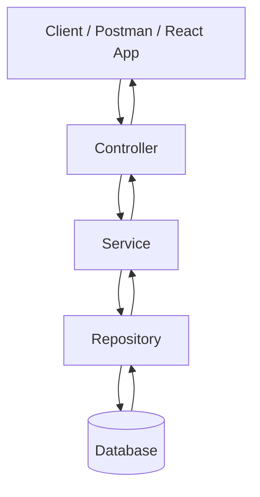

## Meaning of the flow

| Layer | Simple Meaning | Main Work |
|---|---|---|
| Client | Person using API | Sends request |
| Controller | Reception desk | Receives HTTP request |
| Service | Brain | Business logic |
| Repository | Database helper | Talks to database |
| Database | Storage | Stores actual data |

---

# <span style="color:#C2185B">2. Interacting with Database</span>

## What does interacting with database mean?

It means the application can:

- Save data
- Read data
- Update data
- Delete data

These operations are called **CRUD**.

| Operation | Meaning | SQL Example | Repository Method |
|---|---|---|---|
| Create | Save new data | `INSERT` | `save()` |
| Read | Get data | `SELECT` | `findById()`, `findAll()` |
| Update | Modify data | `UPDATE` | `save()` |
| Delete | Remove data | `DELETE` | `deleteById()` |

## Simple explanation with example

Imagine a school register.

- Add new student = Create
- Check student details = Read
- Change student phone number = Update
- Remove old student = Delete

Spring Boot uses repository methods to do these actions easily.

---

# <span style="color:#C2185B">3. Local Database Installation Setup</span>

This setup means PostgreSQL runs directly on your laptop.

## When to use local installation?

Use local installation when:

- You want the database always available on your machine.
- You are comfortable installing PostgreSQL.
- You do not want to start Docker every time.
- You are learning database commands manually.

## Local PostgreSQL setup steps

### Step 1: Install PostgreSQL

Install PostgreSQL from the official PostgreSQL website or using your operating system package manager.

### Step 2: Open PostgreSQL terminal

You can use:

- `psql`
- pgAdmin
- IntelliJ Database tool
- DBeaver

### Step 3: Create database

```sql
CREATE DATABASE spring_jpa_demo;
```

### Step 4: Create user

```sql
CREATE USER spring_user WITH PASSWORD 'spring_password';
```

### Step 5: Give permission

```sql
GRANT ALL PRIVILEGES ON DATABASE spring_jpa_demo TO spring_user;
```

For PostgreSQL schema access, you may also need:

```sql
\c spring_jpa_demo;
GRANT ALL ON SCHEMA public TO spring_user;
```

## Local setup flow

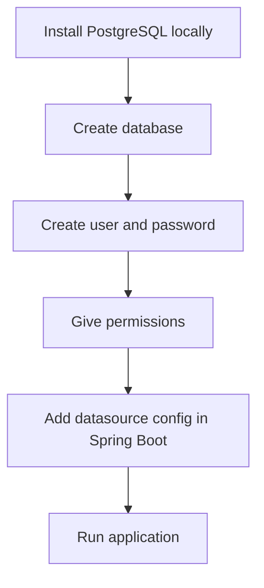

---

# <span style="color:#C2185B">4. Docker Database Setup</span>

## What is Docker database setup?

Docker lets you run PostgreSQL inside a container instead of installing it directly on your computer.

## Simple explanation with example

Think of Docker like a lunch box.

Instead of spreading food everywhere, everything is packed inside one box.

PostgreSQL runs inside that box.

Your Spring Boot app connects to it.

## When to use Docker?

Use Docker when:

- You do not want to install PostgreSQL directly.
- You want the same setup for every developer.
- You want quick start and quick cleanup.
- You want project-specific database setup.

## `docker-compose.yml`

Create this file in your project root:

```yaml
services:
  postgres:
    image: postgres:16
    container_name: spring-jpa-postgres
    environment:
      POSTGRES_DB: spring_jpa_demo
      POSTGRES_USER: spring_user
      POSTGRES_PASSWORD: spring_password
    ports:
      - "5432:5432"
    volumes:
      - postgres_data:/var/lib/postgresql/data

volumes:
  postgres_data:
```

## Start Docker database

```bash
docker compose up -d
```

## Stop Docker database

```bash
docker compose down
```

## Remove database data also

```bash
docker compose down -v
```

Use `-v` carefully because it deletes the database volume.

## Docker setup flow

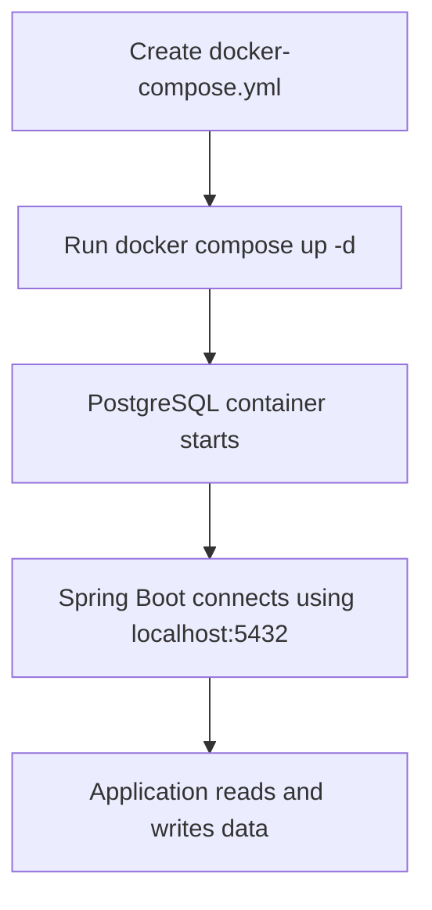

---

# <span style="color:#C2185B">5. Spring Boot Database Configuration</span>

Spring Boot needs database connection details.

Usually we provide them in `application.yml` or `application.properties`.

## Required Maven dependencies

In `pom.xml`:

```xml
<dependencies>
    <dependency>
        <groupId>org.springframework.boot</groupId>
        <artifactId>spring-boot-starter-web</artifactId>
    </dependency>

    <dependency>
        <groupId>org.springframework.boot</groupId>
        <artifactId>spring-boot-starter-data-jpa</artifactId>
    </dependency>

    <dependency>
        <groupId>org.postgresql</groupId>
        <artifactId>postgresql</artifactId>
        <scope>runtime</scope>
    </dependency>

    <dependency>
        <groupId>org.springframework.boot</groupId>
        <artifactId>spring-boot-starter-validation</artifactId>
    </dependency>
</dependencies>
```

## `application.yml` for local PostgreSQL or Docker PostgreSQL

For both local and Docker, if PostgreSQL is running on `localhost:5432`, the config can be the same:

```yaml
spring:
  datasource:
    url: jdbc:postgresql://localhost:5432/spring_jpa_demo
    username: spring_user
    password: spring_password

  jpa:
    hibernate:
      ddl-auto: update
    show-sql: true
    properties:
      hibernate:
        format_sql: true
```

## What each property means

| Property | Meaning |
|---|---|
| `spring.datasource.url` | Database location |
| `spring.datasource.username` | Database username |
| `spring.datasource.password` | Database password |
| `spring.jpa.hibernate.ddl-auto` | Tells Hibernate how to handle tables |
| `spring.jpa.show-sql` | Shows generated SQL in console |
| `hibernate.format_sql` | Prints SQL neatly |

## Separate local and docker profiles

You can keep separate profile files.

### `application-local.yml`

```yaml
spring:
  datasource:
    url: jdbc:postgresql://localhost:5432/spring_jpa_demo
    username: spring_user
    password: spring_password
```

### `application-docker.yml`

If your Spring Boot app runs on your computer and PostgreSQL runs in Docker with port mapping:

```yaml
spring:
  datasource:
    url: jdbc:postgresql://localhost:5432/spring_jpa_demo
    username: spring_user
    password: spring_password
```

If your Spring Boot app also runs inside another Docker container in the same Docker network, use the service name:

```yaml
spring:
  datasource:
    url: jdbc:postgresql://postgres:5432/spring_jpa_demo
    username: spring_user
    password: spring_password
```

## Important note

- `localhost` means “my own machine.”
- Inside a container, `localhost` means “inside this container,” not your laptop.
- So, if both app and database are in Docker Compose, use the database service name like `postgres`.

---

# <span style="color:#C2185B">6. How to Create a Table in Database</span>

There are two common ways.

## Way 1: Manually create table using SQL

```sql
CREATE TABLE students (
    id BIGSERIAL PRIMARY KEY,
    name VARCHAR(100) NOT NULL,
    email VARCHAR(150) NOT NULL UNIQUE,
    age INTEGER
);
```

## Way 2: Let JPA auto-generate table

You create a Java class with JPA annotations.

Hibernate reads the class and creates/updates the table.

```java
import jakarta.persistence.*;

@Entity
@Table(name = "students")
public class Student {

    @Id
    @GeneratedValue(strategy = GenerationType.IDENTITY)
    private Long id;

    @Column(name = "student_name", nullable = false, length = 100)
    private String name;

    @Column(nullable = false, unique = true, length = 150)
    private String email;

    @Column
    private Integer age;

    public Student() {
    }

    public Student(String name, String email, Integer age) {
        this.name = name;
        this.email = email;
        this.age = age;
    }

    public Long getId() {
        return id;
    }

    public String getName() {
        return name;
    }

    public void setName(String name) {
        this.name = name;
    }

    public String getEmail() {
        return email;
    }

    public void setEmail(String email) {
        this.email = email;
    }

    public Integer getAge() {
        return age;
    }

    public void setAge(Integer age) {
        this.age = age;
    }
}
```

## Table mapping flow

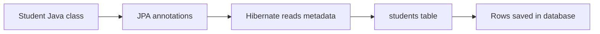

---

# <span style="color:#C2185B">7. How Java Class Maps to Database Table</span>

## What is mapping?

Mapping means connecting Java class fields to database table columns.

| Java Side | Database Side |
|---|---|
| Class | Table |
| Object | Row |
| Field | Column |
| `id` field | Primary key |

## Example

### Java object

```java
Student student = new Student("Rahul", "rahul@example.com", 22);
```

### Database row

| id | student_name | email | age |
|---|---|---|---|
| 1 | Rahul | rahul@example.com | 22 |

## Simple explanation with example

Java class is like an empty form.

Database table is like a register book.

When you fill the Java object and save it, JPA writes one row in the database table.

---

# <span style="color:#C2185B">8. JPA Entity Annotations</span>

## `@Entity`

### Definition

`@Entity` tells JPA:

> “This Java class represents a database table.”

### Example

```java
@Entity
public class Student {
}
```

### When to use?

Use `@Entity` for classes that must be stored in the database.

Examples:

- `User`
- `Product`
- `Order`
- `Employee`
- `Student`

### Drawback

Do not put heavy business logic in entities. Keep them focused on data structure and relationships.

---

## `@Table`

### Definition

`@Table` is used to customize the table name.

### Example

```java
@Entity
@Table(name = "students")
public class Student {
}
```

### When to use?

Use it when the database table name should be different from the Java class name.

Without `@Table`, JPA may use the class name as the table name.

---

## `@Id`

### Definition

`@Id` marks the primary key field.

### Example

```java
@Id
private Long id;
```

### Why do we need primary key?

A primary key uniquely identifies each row.

Simple example:

Two students can have the same name, but their IDs are different.

---

## `@GeneratedValue`

### Definition

`@GeneratedValue` tells JPA how to generate the primary key value.

### Example

```java
@Id
@GeneratedValue(strategy = GenerationType.IDENTITY)
private Long id;
```

### Common strategies

| Strategy | Meaning | Common Use |
|---|---|---|
| `IDENTITY` | Database auto-increments ID | PostgreSQL, MySQL |
| `SEQUENCE` | Uses database sequence | PostgreSQL, Oracle |
| `AUTO` | Provider decides | Simple projects |

### When to use?

Use `IDENTITY` or `SEQUENCE` when you want the database to generate IDs.

---

## `@Column`

### Definition

`@Column` customizes a table column.

### Example

```java
@Column(name = "student_name", nullable = false, length = 100)
private String name;
```

### Common options

| Option | Meaning |
|---|---|
| `name` | Column name in table |
| `nullable` | Allows or blocks null |
| `unique` | Makes value unique |
| `length` | String length |

### When to use?

Use it when you need control over column name, size, uniqueness, or null behavior.

---

# <span style="color:#C2185B">9. Auto Generate Database Tables</span>

Spring Boot can ask Hibernate to create or update tables based on entity classes.

This is controlled by:

```yaml
spring:
  jpa:
    hibernate:
      ddl-auto: update
```

## Common `ddl-auto` values

| Value | Meaning | Use Case |
|---|---|---|
| `none` | Do nothing | Production with migrations |
| `validate` | Check if tables match entities | Production safety check |
| `update` | Update tables based on entities | Development only |
| `create` | Drop and create tables at startup | Testing only |
| `create-drop` | Create at startup, drop at shutdown | Tests / demos |

## Simple explanation with example

Imagine your Java entity is a building plan.

Hibernate reads the plan and builds the table.

If you add a new field like `phoneNumber`, Hibernate can add a new column when `ddl-auto=update`.

## Example

Add field in entity:

```java
@Column(length = 15)
private String phoneNumber;
```

Hibernate may add a column:

```sql
ALTER TABLE students ADD COLUMN phone_number VARCHAR(15);
```

## Best practice

Use this in local development:

```yaml
spring:
  jpa:
    hibernate:
      ddl-auto: update
```

Use this in production:

```yaml
spring:
  jpa:
    hibernate:
      ddl-auto: validate
```

For production table changes, use migration tools like:

- Flyway
- Liquibase

## Drawback

`ddl-auto=update` is easy, but risky for production.

It may not handle complex schema changes safely, such as:

- Renaming columns
- Changing data types
- Splitting tables
- Removing columns

---

# <span style="color:#C2185B">10. JPA Repository</span>

## What is JPA Repository?

`JpaRepository` is an interface from Spring Data JPA.

It gives ready-made database methods.

## Simple explanation with example

Think of repository like a helper at a library.

You say:

> “Find this book.”

The helper knows how to search.

In the same way, you call:

```java
studentRepository.findById(1L);
```

Spring Data JPA knows how to query the database.

## Repository example

```java
import org.springframework.data.jpa.repository.JpaRepository;

import java.util.Optional;

public interface StudentRepository extends JpaRepository<Student, Long> {

    Optional<Student> findByEmail(String email);

    boolean existsByEmail(String email);
}
```

## Why do we use it?

Because it reduces repeated SQL code.

Without repository, you may write:

```sql
SELECT * FROM students WHERE email = ?;
```

With repository:

```java
studentRepository.findByEmail("rahul@example.com");
```

## Built-in methods

| Method | Meaning |
|---|---|
| `save(entity)` | Insert or update |
| `findById(id)` | Find by primary key |
| `findAll()` | Get all rows |
| `deleteById(id)` | Delete by primary key |
| `existsById(id)` | Check if row exists |
| `count()` | Count rows |

## Custom finder methods

Spring Data JPA can create queries from method names.

```java
List<Student> findByAgeGreaterThan(Integer age);
List<Student> findByNameContainingIgnoreCase(String name);
Optional<Student> findByEmail(String email);
```

## When to use repository?

Use repository only for database access.

Good:

```java
studentRepository.findByEmail(email);
```

Bad:

```java
// Do not put business decision logic directly inside repository.
// Example: calculating discount, validating business rules, sending email.
```

Repository should not decide business rules.

Service should decide business rules.

---

# <span style="color:#C2185B">11. Importance of Entity Mapping</span>

## What is entity mapping?

Entity mapping tells JPA how one table is connected to another table.

In real projects, tables are related.

Examples:

- One user has one profile.
- One department has many employees.
- Many students can join many courses.
- One order belongs to one customer.

## Why do we do mapping?

We do mapping because data is connected.

Without mapping, you manually write joins and manage IDs everywhere.

With mapping, Java objects can naturally reference each other.

## Simple explanation with example

A student has an address.

Instead of only storing `address_id`, Java can say:

```java
student.getAddress().getCity();
```

JPA understands how to connect student table and address table.

## When do we use mapping?

Use mapping when:

- Tables are related.
- You need to navigate from one object to another.
- You want JPA to manage relationships.
- You need joins between tables.

## Mapping types

| Mapping | Meaning | Example |
|---|---|---|
| One-to-One | One record connects to one record | User - UserProfile |
| One-to-Many | One record connects to many records | Department - Employees |
| Many-to-One | Many records connect to one record | Employees - Department |
| Many-to-Many | Many records connect to many records | Students - Courses |

## Drawback

Too many direct entity relationships can make code hard to maintain.

Common issues:

- Infinite JSON recursion
- Slow queries
- Lazy loading errors
- Over-fetching unnecessary data
- Complex updates

That is why DTOs are very important.

---

# <span style="color:#C2185B">12. One-to-One Mapping</span>

## Meaning

One row in table A connects to one row in table B.

Example:

One `User` has one `UserProfile`.

## Database idea

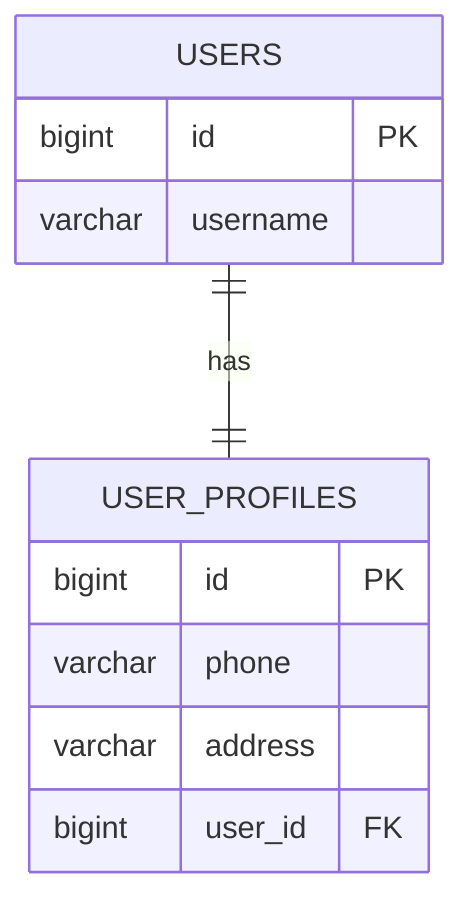

## User entity

```java
import jakarta.persistence.*;

@Entity
@Table(name = "users")
public class User {

    @Id
    @GeneratedValue(strategy = GenerationType.IDENTITY)
    private Long id;

    @Column(nullable = false, unique = true)
    private String username;

    @OneToOne(mappedBy = "user", cascade = CascadeType.ALL)
    private UserProfile profile;

    public User() {
    }

    public User(String username) {
        this.username = username;
    }

    public Long getId() {
        return id;
    }

    public String getUsername() {
        return username;
    }

    public void setUsername(String username) {
        this.username = username;
    }

    public UserProfile getProfile() {
        return profile;
    }

    public void setProfile(UserProfile profile) {
        this.profile = profile;
        profile.setUser(this);
    }
}
```

## UserProfile entity

```java
import jakarta.persistence.*;

@Entity
@Table(name = "user_profiles")
public class UserProfile {

    @Id
    @GeneratedValue(strategy = GenerationType.IDENTITY)
    private Long id;

    private String phone;

    private String address;

    @OneToOne
    @JoinColumn(name = "user_id", nullable = false, unique = true)
    private User user;

    public UserProfile() {
    }

    public UserProfile(String phone, String address) {
        this.phone = phone;
        this.address = address;
    }

    public Long getId() {
        return id;
    }

    public String getPhone() {
        return phone;
    }

    public void setPhone(String phone) {
        this.phone = phone;
    }

    public String getAddress() {
        return address;
    }

    public void setAddress(String address) {
        this.address = address;
    }

    public User getUser() {
        return user;
    }

    public void setUser(User user) {
        this.user = user;
    }
}
```

## Important points

| Code | Meaning |
|---|---|
| `@OneToOne` | One object connects to one object |
| `@JoinColumn(name = "user_id")` | Foreign key column is in `user_profiles` table |
| `mappedBy = "user"` | Other side owns the relationship |
| `cascade = CascadeType.ALL` | Saving user can also save profile |

## When to use one-to-one?

Use one-to-one when both records are strongly connected but logically separate.

Examples:

- User and profile
- Employee and employee badge
- Person and passport

---

# <span style="color:#C2185B">13. One-to-Many and Many-to-One Mapping</span>

## Meaning

One record can have many child records.

Example:

One `Department` has many `Employees`.

Each `Employee` belongs to one `Department`.

## Database idea

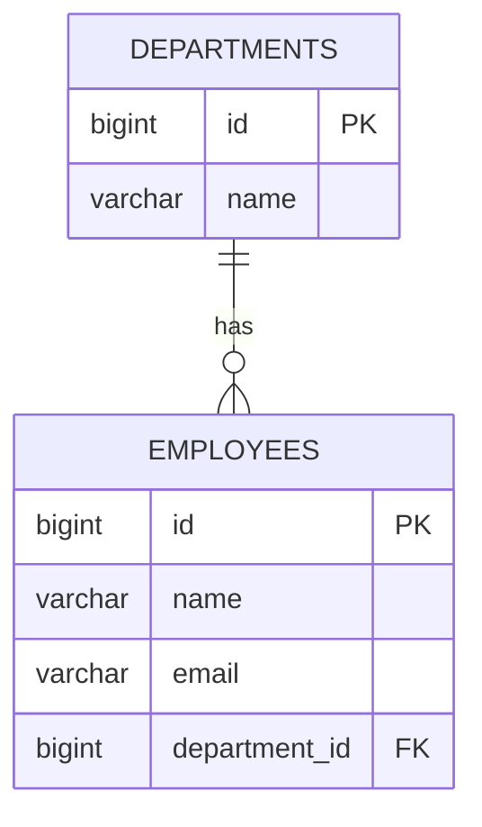

## Department entity

```java
import jakarta.persistence.*;
import java.util.ArrayList;
import java.util.List;

@Entity
@Table(name = "departments")
public class Department {

    @Id
    @GeneratedValue(strategy = GenerationType.IDENTITY)
    private Long id;

    @Column(nullable = false, unique = true)
    private String name;

    @OneToMany(mappedBy = "department", cascade = CascadeType.ALL, orphanRemoval = true)
    private List<Employee> employees = new ArrayList<>();

    public Department() {
    }

    public Department(String name) {
        this.name = name;
    }

    public Long getId() {
        return id;
    }

    public String getName() {
        return name;
    }

    public void setName(String name) {
        this.name = name;
    }

    public List<Employee> getEmployees() {
        return employees;
    }

    public void addEmployee(Employee employee) {
        employees.add(employee);
        employee.setDepartment(this);
    }

    public void removeEmployee(Employee employee) {
        employees.remove(employee);
        employee.setDepartment(null);
    }
}
```

## Employee entity

```java
import jakarta.persistence.*;

@Entity
@Table(name = "employees")
public class Employee {

    @Id
    @GeneratedValue(strategy = GenerationType.IDENTITY)
    private Long id;

    @Column(nullable = false)
    private String name;

    @Column(nullable = false, unique = true)
    private String email;

    @ManyToOne(fetch = FetchType.LAZY)
    @JoinColumn(name = "department_id", nullable = false)
    private Department department;

    public Employee() {
    }

    public Employee(String name, String email) {
        this.name = name;
        this.email = email;
    }

    public Long getId() {
        return id;
    }

    public String getName() {
        return name;
    }

    public void setName(String name) {
        this.name = name;
    }

    public String getEmail() {
        return email;
    }

    public void setEmail(String email) {
        this.email = email;
    }

    public Department getDepartment() {
        return department;
    }

    public void setDepartment(Department department) {
        this.department = department;
    }
}
```

## Important points

| Code | Meaning |
|---|---|
| `@OneToMany(mappedBy = "department")` | Department has many employees |
| `@ManyToOne` | Many employees belong to one department |
| `@JoinColumn(name = "department_id")` | Foreign key column exists in employee table |
| `FetchType.LAZY` | Load department only when needed |
| `orphanRemoval = true` | Remove child if removed from parent collection |

## Which side owns the relationship?

In this example, `Employee` owns the relationship because it has the foreign key column:

```java
@JoinColumn(name = "department_id")
```

## When to use one-to-many / many-to-one?

Use it when one parent has multiple children.

Examples:

- Customer has many orders.
- Department has many employees.
- Blog post has many comments.
- Country has many states.

---

# <span style="color:#C2185B">14. Many-to-Many Mapping</span>

## Meaning

Many rows in table A connect to many rows in table B.

Example:

One student can join many courses.

One course can have many students.

## Database idea

A many-to-many relationship needs a middle table.

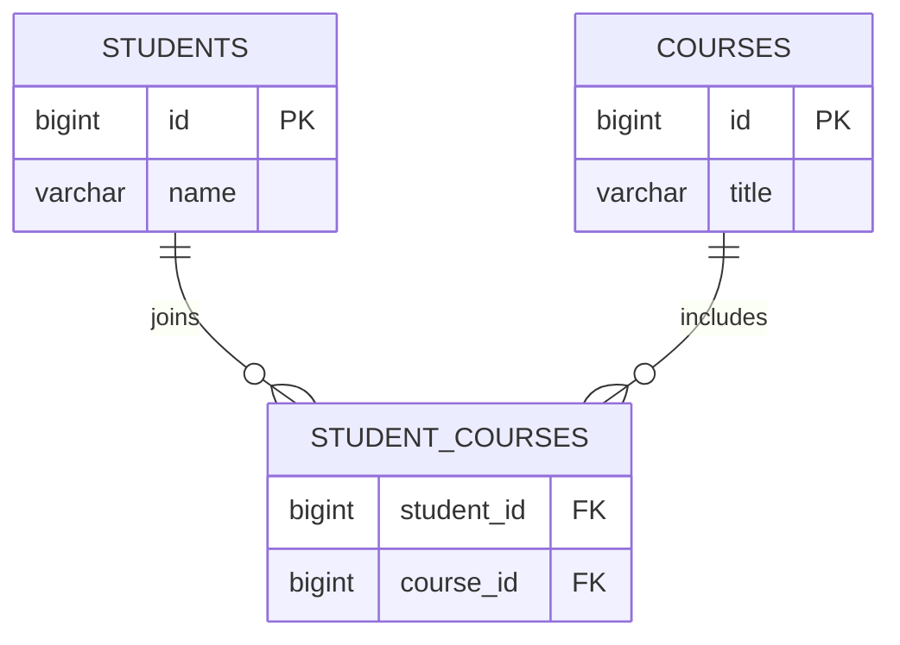

## Student entity

```java
import jakarta.persistence.*;
import java.util.HashSet;
import java.util.Set;

@Entity
@Table(name = "students")
public class Student {

    @Id
    @GeneratedValue(strategy = GenerationType.IDENTITY)
    private Long id;

    @Column(nullable = false)
    private String name;

    @ManyToMany
    @JoinTable(
        name = "student_courses",
        joinColumns = @JoinColumn(name = "student_id"),
        inverseJoinColumns = @JoinColumn(name = "course_id")
    )
    private Set<Course> courses = new HashSet<>();

    public Student() {
    }

    public Student(String name) {
        this.name = name;
    }

    public Long getId() {
        return id;
    }

    public String getName() {
        return name;
    }

    public void setName(String name) {
        this.name = name;
    }

    public Set<Course> getCourses() {
        return courses;
    }

    public void addCourse(Course course) {
        courses.add(course);
        course.getStudents().add(this);
    }
}
```

## Course entity

```java
import jakarta.persistence.*;
import java.util.HashSet;
import java.util.Set;

@Entity
@Table(name = "courses")
public class Course {

    @Id
    @GeneratedValue(strategy = GenerationType.IDENTITY)
    private Long id;

    @Column(nullable = false)
    private String title;

    @ManyToMany(mappedBy = "courses")
    private Set<Student> students = new HashSet<>();

    public Course() {
    }

    public Course(String title) {
        this.title = title;
    }

    public Long getId() {
        return id;
    }

    public String getTitle() {
        return title;
    }

    public void setTitle(String title) {
        this.title = title;
    }

    public Set<Student> getStudents() {
        return students;
    }
}
```

## Important points

| Code | Meaning |
|---|---|
| `@ManyToMany` | Many records connect to many records |
| `@JoinTable` | Creates middle table |
| `joinColumns` | Column for current entity |
| `inverseJoinColumns` | Column for other entity |
| `mappedBy` | Other side owns the relationship |

## Real project best practice

Direct `@ManyToMany` is okay for learning.

In real projects, many-to-many often becomes two one-to-many relationships using a separate entity.

Example:

Instead of:

```text
Student <-> Course
```

Use:

```text
Student -> Enrollment -> Course
```

Why?

Because the middle relationship may need extra fields:

- enrollment date
- grade
- status
- payment status

---

# <span style="color:#C2185B">15. JsonManagedReference and JsonBackReference</span>

## Why do we need these?

When two entities point to each other, JSON conversion can go into an infinite loop.

Example:

- Department has employees.
- Employee has department.

When converting Department to JSON:

```text
Department -> employees -> department -> employees -> department -> ...
```

This can continue forever.

## Simple explanation with example

Imagine two mirrors facing each other.

The reflection keeps repeating.

Bidirectional entity JSON has the same problem.

## `@JsonManagedReference` and `@JsonBackReference`

- `@JsonManagedReference` is used on the parent/forward side.
- `@JsonBackReference` is used on the child/back side.

## Department entity

```java
import com.fasterxml.jackson.annotation.JsonManagedReference;
import jakarta.persistence.*;
import java.util.ArrayList;
import java.util.List;

@Entity
@Table(name = "departments")
public class Department {

    @Id
    @GeneratedValue(strategy = GenerationType.IDENTITY)
    private Long id;

    private String name;

    @JsonManagedReference
    @OneToMany(mappedBy = "department", cascade = CascadeType.ALL)
    private List<Employee> employees = new ArrayList<>();
}
```

## Employee entity

```java
import com.fasterxml.jackson.annotation.JsonBackReference;
import jakarta.persistence.*;

@Entity
@Table(name = "employees")
public class Employee {

    @Id
    @GeneratedValue(strategy = GenerationType.IDENTITY)
    private Long id;

    private String name;

    @JsonBackReference
    @ManyToOne(fetch = FetchType.LAZY)
    @JoinColumn(name = "department_id")
    private Department department;
}
```

## Output example

When returning department:

```json
{
  "id": 1,
  "name": "IT",
  "employees": [
    {
      "id": 10,
      "name": "Asha"
    }
  ]
}
```

Notice employee does not again show department.

## Important best practice

`@JsonManagedReference` and `@JsonBackReference` can solve recursion, but in REST APIs, DTOs are usually cleaner.

Better approach:

```text
Entity -> DTO -> JSON response
```

Not:

```text
Entity -> JSON response directly
```

---

# <span style="color:#C2185B">16. DTO</span>

## What is DTO?

DTO means **Data Transfer Object**.

It is an object used to carry data between layers or between API and client.

## Simple explanation with example

Imagine your database entity is your full school record.

It has:

- name
- age
- email
- password
- internal notes
- created date
- updated date

But when someone asks for student details, you should not show everything.

DTO is like a safe copy that only shows what is needed.

## Entity vs DTO

### Entity

```java
@Entity
@Table(name = "students")
public class Student {

    @Id
    @GeneratedValue(strategy = GenerationType.IDENTITY)
    private Long id;

    private String name;

    private String email;

    private String password;

    private String internalNote;
}
```

### Response DTO

```java
public record StudentResponseDto(
    Long id,
    String name,
    String email
) {
}
```

Now API response will not expose `password` or `internalNote`.

## Why do we use DTO?

### 1. Data Separation

Entity represents database table.

DTO represents API request or response.

They are different responsibilities.

### 2. Abstraction

DTO hides internal database design.

Example:

Database may store:

```text
first_name
last_name
```

API can return:

```json
{
  "fullName": "Rahul Sharma"
}
```

### 3. Flexibility

You can change API response without changing database entity.

### 4. Versioning

You can create different DTOs for different API versions.

```java
public record StudentResponseV1(Long id, String name) {
}

public record StudentResponseV2(Long id, String name, String email) {
}
```

### 5. Security

DTO prevents exposing sensitive fields.

Do not return password, token, salary, internal notes, or database-only fields unless needed.

---

# <span style="color:#C2185B">17. Why Use DTO as Record</span>

## What is a Java record?

A record is a compact Java class used to hold data.

Example:

```java
public record StudentResponseDto(
    Long id,
    String name,
    String email
) {
}
```

This automatically gives:

- Constructor
- Getter-like methods
- `equals()`
- `hashCode()`
- `toString()`

## Same DTO as normal class

```java
public class StudentResponseDto {

    private Long id;
    private String name;
    private String email;

    public StudentResponseDto(Long id, String name, String email) {
        this.id = id;
        this.name = name;
        this.email = email;
    }

    public Long getId() {
        return id;
    }

    public String getName() {
        return name;
    }

    public String getEmail() {
        return email;
    }
}
```

## Record version

```java
public record StudentResponseDto(Long id, String name, String email) {
}
```

Much cleaner.

## Why records are good for DTOs

| Benefit | Explanation |
|---|---|
| Less code | No manual getters/constructors needed |
| Immutable style | DTO data is not accidentally changed |
| Clear purpose | Record clearly means data carrier |
| Better readability | Small and clean |
| Good for API request/response | Perfect for transferring data |

## Important note

A record field accessor does not use `getName()`.

It uses:

```java
studentDto.name();
studentDto.email();
```

## When not to use record DTO?

Do not use record if:

- You need many mutable fields.
- You need complex behavior.
- You need no-args constructor for a specific old library.
- You are using older Java versions before records.

---

# <span style="color:#C2185B">18. DTO with GET and POST Requests</span>

## Why separate request DTO and response DTO?

Data coming into API and data going out of API are usually different.

Example:

For creating a student, client sends:

```json
{
  "name": "Rahul",
  "email": "rahul@example.com",
  "age": 22
}
```

After saving, API returns:

```json
{
  "id": 1,
  "name": "Rahul",
  "email": "rahul@example.com",
  "age": 22
}
```

Request has no ID.

Response has ID.

## Create request DTO

```java
import jakarta.validation.constraints.Email;
import jakarta.validation.constraints.Min;
import jakarta.validation.constraints.NotBlank;

public record CreateStudentRequestDto(
    @NotBlank(message = "Name is required")
    String name,

    @Email(message = "Email must be valid")
    @NotBlank(message = "Email is required")
    String email,

    @Min(value = 1, message = "Age must be greater than 0")
    Integer age
) {
}
```

## Response DTO

```java
public record StudentResponseDto(
    Long id,
    String name,
    String email,
    Integer age
) {
}
```

## Mapper methods

```java
public class StudentMapper {

    private StudentMapper() {
    }

    public static Student toEntity(CreateStudentRequestDto request) {
        return new Student(
            request.name(),
            request.email(),
            request.age()
        );
    }

    public static StudentResponseDto toResponseDto(Student student) {
        return new StudentResponseDto(
            student.getId(),
            student.getName(),
            student.getEmail(),
            student.getAge()
        );
    }
}
```

## POST request flow

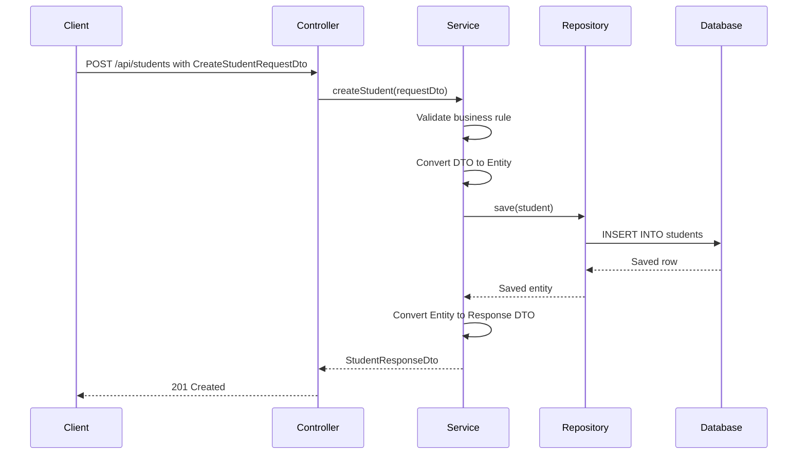

## GET request flow

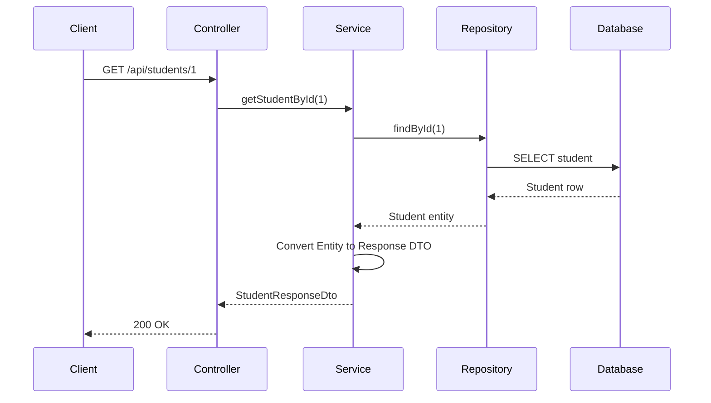

## DTO abstraction example

Entity has separate first and last name:

```java
private String firstName;
private String lastName;
```

DTO returns one full name:

```java
public record UserResponseDto(
    Long id,
    String fullName
) {
}
```

Mapping:

```java
public static UserResponseDto toDto(User user) {
    return new UserResponseDto(
        user.getId(),
        user.getFirstName() + " " + user.getLastName()
    );
}
```

The client does not need to know how the database stores the name.

That is abstraction.

## DTO encapsulation example

Entity has password:

```java
private String password;
```

Response DTO does not include password:

```java
public record UserResponseDto(
    Long id,
    String username,
    String email
) {
}
```

Now password is protected from API response.

That is encapsulation.

---

# <span style="color:#C2185B">19. Controller Service Repository Layers</span>

## Why do we split code into layers?

Because each layer has a different job.

If all code is inside controller, the application becomes messy.

Layering keeps code clean, testable, and maintainable.

## Simple explanation with example

Think of a restaurant.

| Restaurant Role | Spring Boot Layer |
|---|---|
| Customer | Client |
| Waiter | Controller |
| Chef | Service |
| Store room worker | Repository |
| Store room | Database |

Customer tells waiter the order.

Waiter does not cook.

Chef cooks.

Store room worker gets ingredients.

Each person has a clear job.

## Layer responsibility

| Layer | What goes here | What should not go here |
|---|---|---|
| Controller | HTTP request/response, URL mapping, status codes | Business rules, database queries |
| Service | Business logic, validation, transactions, DTO mapping | HTTP annotations like `@GetMapping` |
| Repository | Database access only | Business decisions |
| Entity | Database structure and relationships | API response formatting |
| DTO | API request/response data | Database relationship logic |

## Flow diagram

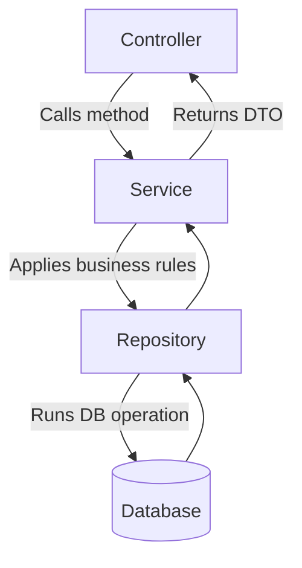

## How to know where code should go?

### Put code in Controller if it is about HTTP

Examples:

```java
@GetMapping("/{id}")
@PostMapping
@ResponseStatus(HttpStatus.CREATED)
@RequestBody
@PathVariable
```

### Put code in Service if it is about business rules

Examples:

- Check if email already exists.
- Calculate discount.
- Validate order amount.
- Convert DTO to entity.
- Throw business exception.
- Use `@Transactional`.

### Put code in Repository if it is about database query

Examples:

```java
findByEmail(String email)
existsByEmail(String email)
findByAgeGreaterThan(Integer age)
```

## Bad example: Everything in controller

```java
@RestController
@RequestMapping("/api/students")
public class StudentController {

    private final StudentRepository studentRepository;

    public StudentController(StudentRepository studentRepository) {
        this.studentRepository = studentRepository;
    }

    @PostMapping
    public Student createStudent(@RequestBody Student student) {
        if (studentRepository.existsByEmail(student.getEmail())) {
            throw new RuntimeException("Email already exists");
        }
        return studentRepository.save(student);
    }
}
```

### Problem

Controller is doing too much:

- Receiving request
- Checking business rule
- Calling database
- Returning entity directly

## Good example: Separate layers

```text
StudentController -> StudentService -> StudentRepository -> Database
```

---

# <span style="color:#C2185B">20. Complete Mini Project Example</span>

This example creates a simple Student API.

## Project structure

```text
src/main/java/com/example/demo
│
├── DemoApplication.java
│
├── controller
│   └── StudentController.java
│
├── dto
│   ├── CreateStudentRequestDto.java
│   └── StudentResponseDto.java
│
├── entity
│   └── Student.java
│
├── exception
│   ├── DuplicateEmailException.java
│   └── ResourceNotFoundException.java
│
├── mapper
│   └── StudentMapper.java
│
├── repository
│   └── StudentRepository.java
│
└── service
    └── StudentService.java
```

---

## Entity

```java
package com.example.demo.entity;

import jakarta.persistence.*;

@Entity
@Table(name = "students")
public class Student {

    @Id
    @GeneratedValue(strategy = GenerationType.IDENTITY)
    private Long id;

    @Column(nullable = false, length = 100)
    private String name;

    @Column(nullable = false, unique = true, length = 150)
    private String email;

    @Column(nullable = false)
    private Integer age;

    public Student() {
    }

    public Student(String name, String email, Integer age) {
        this.name = name;
        this.email = email;
        this.age = age;
    }

    public Long getId() {
        return id;
    }

    public String getName() {
        return name;
    }

    public void setName(String name) {
        this.name = name;
    }

    public String getEmail() {
        return email;
    }

    public void setEmail(String email) {
        this.email = email;
    }

    public Integer getAge() {
        return age;
    }

    public void setAge(Integer age) {
        this.age = age;
    }
}
```

---

## DTOs

```java
package com.example.demo.dto;

import jakarta.validation.constraints.Email;
import jakarta.validation.constraints.Min;
import jakarta.validation.constraints.NotBlank;
import jakarta.validation.constraints.NotNull;

public record CreateStudentRequestDto(
    @NotBlank(message = "Name is required")
    String name,

    @Email(message = "Email must be valid")
    @NotBlank(message = "Email is required")
    String email,

    @NotNull(message = "Age is required")
    @Min(value = 1, message = "Age must be greater than 0")
    Integer age
) {
}
```

```java
package com.example.demo.dto;

public record StudentResponseDto(
    Long id,
    String name,
    String email,
    Integer age
) {
}
```

---

## Mapper

```java
package com.example.demo.mapper;

import com.example.demo.dto.CreateStudentRequestDto;
import com.example.demo.dto.StudentResponseDto;
import com.example.demo.entity.Student;

public class StudentMapper {

    private StudentMapper() {
    }

    public static Student toEntity(CreateStudentRequestDto request) {
        return new Student(
            request.name(),
            request.email(),
            request.age()
        );
    }

    public static StudentResponseDto toResponseDto(Student student) {
        return new StudentResponseDto(
            student.getId(),
            student.getName(),
            student.getEmail(),
            student.getAge()
        );
    }
}
```

---

## Repository

```java
package com.example.demo.repository;

import com.example.demo.entity.Student;
import org.springframework.data.jpa.repository.JpaRepository;

import java.util.Optional;

public interface StudentRepository extends JpaRepository<Student, Long> {

    Optional<Student> findByEmail(String email);

    boolean existsByEmail(String email);
}
```

---

## Exceptions

```java
package com.example.demo.exception;

public class ResourceNotFoundException extends RuntimeException {

    public ResourceNotFoundException(String message) {
        super(message);
    }
}
```

```java
package com.example.demo.exception;

public class DuplicateEmailException extends RuntimeException {

    public DuplicateEmailException(String message) {
        super(message);
    }
}
```

---

## Service

```java
package com.example.demo.service;

import com.example.demo.dto.CreateStudentRequestDto;
import com.example.demo.dto.StudentResponseDto;
import com.example.demo.entity.Student;
import com.example.demo.exception.DuplicateEmailException;
import com.example.demo.exception.ResourceNotFoundException;
import com.example.demo.mapper.StudentMapper;
import com.example.demo.repository.StudentRepository;
import org.springframework.stereotype.Service;
import org.springframework.transaction.annotation.Transactional;

import java.util.List;

@Service
public class StudentService {

    private final StudentRepository studentRepository;

    public StudentService(StudentRepository studentRepository) {
        this.studentRepository = studentRepository;
    }

    @Transactional
    public StudentResponseDto createStudent(CreateStudentRequestDto request) {
        if (studentRepository.existsByEmail(request.email())) {
            throw new DuplicateEmailException("Email already exists: " + request.email());
        }

        Student student = StudentMapper.toEntity(request);
        Student savedStudent = studentRepository.save(student);

        return StudentMapper.toResponseDto(savedStudent);
    }

    @Transactional(readOnly = true)
    public StudentResponseDto getStudentById(Long id) {
        Student student = studentRepository.findById(id)
            .orElseThrow(() -> new ResourceNotFoundException("Student not found with id: " + id));

        return StudentMapper.toResponseDto(student);
    }

    @Transactional(readOnly = true)
    public List<StudentResponseDto> getAllStudents() {
        return studentRepository.findAll()
            .stream()
            .map(StudentMapper::toResponseDto)
            .toList();
    }
}
```

---

## Controller

```java
package com.example.demo.controller;

import com.example.demo.dto.CreateStudentRequestDto;
import com.example.demo.dto.StudentResponseDto;
import com.example.demo.service.StudentService;
import jakarta.validation.Valid;
import org.springframework.http.HttpStatus;
import org.springframework.web.bind.annotation.*;

import java.util.List;

@RestController
@RequestMapping("/api/students")
public class StudentController {

    private final StudentService studentService;

    public StudentController(StudentService studentService) {
        this.studentService = studentService;
    }

    @PostMapping
    @ResponseStatus(HttpStatus.CREATED)
    public StudentResponseDto createStudent(@Valid @RequestBody CreateStudentRequestDto request) {
        return studentService.createStudent(request);
    }

    @GetMapping("/{id}")
    public StudentResponseDto getStudentById(@PathVariable Long id) {
        return studentService.getStudentById(id);
    }

    @GetMapping
    public List<StudentResponseDto> getAllStudents() {
        return studentService.getAllStudents();
    }
}
```

---

## Global exception handler

```java
package com.example.demo.exception;

import org.springframework.http.HttpStatus;
import org.springframework.web.bind.annotation.ExceptionHandler;
import org.springframework.web.bind.annotation.ResponseStatus;
import org.springframework.web.bind.annotation.RestControllerAdvice;

import java.time.LocalDateTime;

@RestControllerAdvice
public class GlobalExceptionHandler {

    @ExceptionHandler(ResourceNotFoundException.class)
    @ResponseStatus(HttpStatus.NOT_FOUND)
    public ErrorResponse handleResourceNotFound(ResourceNotFoundException exception) {
        return new ErrorResponse(
            LocalDateTime.now(),
            exception.getMessage(),
            404
        );
    }

    @ExceptionHandler(DuplicateEmailException.class)
    @ResponseStatus(HttpStatus.CONFLICT)
    public ErrorResponse handleDuplicateEmail(DuplicateEmailException exception) {
        return new ErrorResponse(
            LocalDateTime.now(),
            exception.getMessage(),
            409
        );
    }

    public record ErrorResponse(
        LocalDateTime timestamp,
        String message,
        int status
    ) {
    }
}
```

---

## Test API using Postman

### Create student

```http
POST http://localhost:8080/api/students
Content-Type: application/json
```

Request body:

```json
{
  "name": "Rahul",
  "email": "rahul@example.com",
  "age": 22
}
```

Response:

```json
{
  "id": 1,
  "name": "Rahul",
  "email": "rahul@example.com",
  "age": 22
}
```

### Get student by ID

```http
GET http://localhost:8080/api/students/1
```

### Get all students

```http
GET http://localhost:8080/api/students
```

---

# <span style="color:#C2185B">21. Interview Quick Revision</span>

## Database interaction

Spring Boot interacts with a database using datasource configuration, JPA entities, repositories, and Hibernate as the JPA provider.

## Local vs Docker database

Local database is installed directly on the machine.

Docker database runs inside a container.

Docker is better for consistent team setup.

## Entity

An entity is a Java class mapped to a database table.

`@Entity` tells JPA to manage the class.

## Table mapping

Class maps to table.

Object maps to row.

Field maps to column.

## `@Id`

Marks the primary key.

## `@GeneratedValue`

Automatically generates primary key values.

## `@Column`

Customizes column details such as name, length, nullable, and unique.

## Auto table generation

Hibernate can create/update tables using `ddl-auto`.

Use `update` for local development.

Use `validate` or migrations for production.

## JPA Repository

`JpaRepository` gives ready-made CRUD methods and custom finder method support.

It reduces boilerplate database code.

## Mapping

Mapping connects related tables as Java relationships.

Use it when tables have real relationships.

## One-to-One

One user has one profile.

## One-to-Many

One department has many employees.

## Many-to-One

Many employees belong to one department.

## Many-to-Many

Many students can join many courses.

In real projects, prefer a join entity if the relationship has extra fields.

## DTO

DTO carries data between API and application.

It protects entities and hides internal database details.

## Why DTO records?

Records are short, immutable-style, readable, and perfect for request/response data.

## Controller

Handles HTTP request and response.

## Service

Handles business logic.

## Repository

Handles database access.

## Best practice answer

In Spring Boot, I usually follow a layered architecture. The controller handles REST endpoints, the service contains business logic and transaction handling, and the repository handles database operations using Spring Data JPA. Entities represent database tables, but I avoid returning entities directly from APIs. I use DTOs for request and response objects to protect sensitive data, keep API contracts stable, and separate database design from external API design.

---

# <span style="color:#2E7D32">Important Best Practices</span>

1. Do not return entities directly from REST APIs in real projects.
2. Use DTOs for request and response.
3. Keep business logic in service layer.
4. Keep database queries in repository layer.
5. Use constructor injection.
6. Use `@Transactional` in service layer for write operations.
7. Use `ddl-auto=update` only for development.
8. Use Flyway or Liquibase for production database changes.
9. Be careful with bidirectional mapping.
10. Prefer DTOs over `@JsonManagedReference` / `@JsonBackReference` for clean API responses.

---

# <span style="color:#2E7D32">Common Mistakes</span>

## Mistake 1: Returning entity directly

Bad:

```java
@GetMapping("/{id}")
public Student getStudent(@PathVariable Long id) {
    return studentRepository.findById(id).orElseThrow();
}
```

Better:

```java
@GetMapping("/{id}")
public StudentResponseDto getStudent(@PathVariable Long id) {
    return studentService.getStudentById(id);
}
```

## Mistake 2: Putting business logic in repository

Repository should not calculate discounts or validate business rules.

## Mistake 3: Putting database code in controller

Controller should not directly manage complex database operations.

## Mistake 4: Using `ddl-auto=update` in production

Use migration tools in production.

## Mistake 5: Creating bidirectional mappings everywhere

Only create bidirectional mapping when you really need navigation from both sides.

---

# <span style="color:#2E7D32">Final Flow Summary</span>

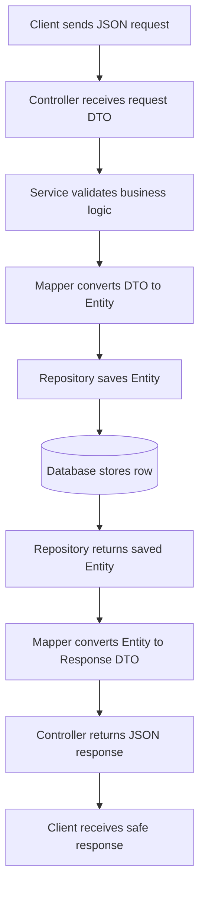

---

# <span style="color:#2E7D32">Official Reference Notes</span>

This README follows the current Spring Boot, Spring Data JPA, Jakarta Persistence, and Jackson annotation concepts:

- Spring Boot data access and database initialization
- Spring Data JPA repository abstraction
- Jakarta Persistence entity and object-relational mapping annotations
- Jackson JSON annotations for managed and back references

