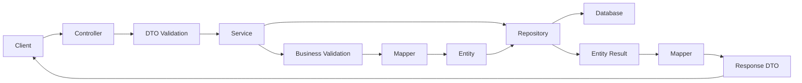
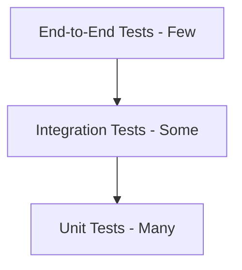
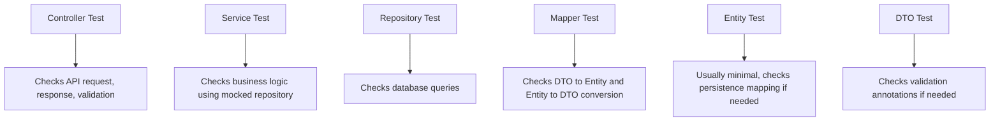

# Spring Boot REST API Data Validation and Testing

<p style="color:#0B5394; font-size:18px;"><b>Goal of this README</b></p>

This README explains **Data Validation** and **Testing** in a Spring Boot REST API in a simple, practical way with code examples and flow diagrams.

You will learn:

- Why validation is important in REST APIs
- Which dependency is needed for validation
- Where validation code is written in a Spring Boot project
- How validation exceptions are handled
- Why testing is important
- Unit testing, integration testing, and end-to-end testing
- Spring Boot test dependencies
- `@SpringBootTest`, JUnit 5, JUnit 4 `@RunWith(SpringRunner.class)`
- Mockito and test isolation
- What classes should be tested in this flow:

```text
Controller -> Service -> Repository & Mapper -> Entity and DTO
```

---

# <span style="color:#38761D;">1. Data Validation in REST API</span>

## <span style="color:#674EA7;">Definition</span>

**Data validation** means checking whether the data coming into your API is correct before your application uses it.

For example, if a user creates an account, we should check:

- Name should not be empty
- Email should be valid
- Age should not be negative
- Password should follow rules
- Price should be greater than zero

## <span style="color:#674EA7;">Simple explanation with example</span>

Think of your REST API like a school gate.

Before students enter the school, the security guard checks:

- Do they have an ID card?
- Are they allowed inside?
- Are they carrying anything unsafe?

Validation is like that security guard for your API.

It checks the incoming request before allowing it into the business logic.

---

# <span style="color:#38761D;">2. Why We Use Data Validation</span>

## <span style="color:#674EA7;">1. Data Integrity</span>

Validation protects the correctness of data.

Without validation, bad data can enter the database.

Example:

```json
{
  "name": "",
  "email": "wrong-email",
  "age": -10
}
```

This data should not be saved.

---

## <span style="color:#674EA7;">2. Preventing Attacks</span>

Validation helps reduce unsafe input.

Example:

```json
{
  "name": "<script>alert('hack')</script>"
}
```

Validation alone is not full security, but it is one important protection layer.

---

## <span style="color:#674EA7;">3. Error Prevention</span>

Validation catches problems early.

Example:

If `email` is required but missing, the API can return a clear error before service logic runs.

---

## <span style="color:#674EA7;">4. Better User Experience</span>

Instead of returning a confusing server error, validation returns a useful message.

Bad response:

```json
{
  "error": "Internal Server Error"
}
```

Good response:

```json
{
  "email": "Email must be valid"
}
```

---

## <span style="color:#674EA7;">5. Performance</span>

Validation avoids unnecessary processing.

If the input is already wrong, we do not need to call:

- Service logic
- Database
- External APIs

This saves time and resources.

---

## <span style="color:#674EA7;">6. Business Logic Compliance</span>

Validation helps enforce business rules.

Example:

- Loan amount must be greater than 1000
- Student age must be at least 18
- Product price must be positive

Some basic rules can be handled by annotations.
More complex rules should be handled in the service layer.

---

# <span style="color:#38761D;">3. Validation Flow in Spring Boot REST API</span>

```mermaid
flowchart TD
    A[Client sends JSON request] --> B[Controller receives request]
    B --> C[@Valid checks DTO fields]
    C -->|Valid data| D[Service layer runs business logic]
    D --> E[Repository saves/fetches data]
    E --> F[Database]
    C -->|Invalid data| G[Validation exception]
    G --> H[Global Exception Handler]
    H --> I[Return clear error response]
```

## <span style="color:#674EA7;">Explanation</span>

1. Client sends JSON data.
2. Controller receives it.
3. `@Valid` checks the request DTO.
4. If data is valid, request continues to service.
5. If data is invalid, Spring throws an exception.
6. Global exception handler catches it.
7. API returns a clean error response.

---

# <span style="color:#38761D;">4. Dependency for Validation</span>

## <span style="color:#674EA7;">Maven Dependency</span>

Add this dependency in `pom.xml`:

```xml
<dependency>
    <groupId>org.springframework.boot</groupId>
    <artifactId>spring-boot-starter-validation</artifactId>
</dependency>
```

## <span style="color:#674EA7;">Why this dependency is needed</span>

Spring Boot does not automatically include validation in every project.

This starter adds Bean Validation support, commonly using Hibernate Validator behind the scenes.

It allows us to use annotations like:

```java
@NotBlank
@NotNull
@Email
@Size
@Min
@Max
@Positive
@Past
@Future
```

---

# <span style="color:#38761D;">5. Where to Add Validation in a Spring Boot Application</span>

Validation is usually added in these files:

```text
src/main/java/com/example/demo
│
├── controller
│   └── StudentController.java
│
├── dto
│   ├── StudentRequest.java
│   └── StudentResponse.java
│
├── service
│   ├── StudentService.java
│   └── StudentServiceImpl.java
│
├── repository
│   └── StudentRepository.java
│
├── entity
│   └── Student.java
│
├── mapper
│   └── StudentMapper.java
│
└── exception
    └── GlobalExceptionHandler.java
```

## <span style="color:#674EA7;">Best place for validation</span>

| File | What validation goes here? |
|---|---|
| DTO | Request field validation using annotations |
| Controller | Add `@Valid` to trigger validation |
| Service | Business rule validation |
| Exception Handler | Format validation errors clearly |
| Entity | Database-level validation if needed |

---

# <span style="color:#38761D;">6. Example: Student REST API with Validation</span>

## <span style="color:#674EA7;">StudentRequest DTO</span>

```java
package com.example.demo.dto;

import jakarta.validation.constraints.Email;
import jakarta.validation.constraints.Max;
import jakarta.validation.constraints.Min;
import jakarta.validation.constraints.NotBlank;
import jakarta.validation.constraints.NotNull;
import jakarta.validation.constraints.Size;

public record StudentRequest(

        @NotBlank(message = "Name is required")
        @Size(min = 2, max = 50, message = "Name must be between 2 and 50 characters")
        String name,

        @NotBlank(message = "Email is required")
        @Email(message = "Email must be valid")
        String email,

        @NotNull(message = "Age is required")
        @Min(value = 18, message = "Age must be at least 18")
        @Max(value = 60, message = "Age must be less than or equal to 60")
        Integer age,

        @NotBlank(message = "Course is required")
        String course
) {
}
```

## <span style="color:#674EA7;">Why validation is added in DTO</span>

DTO receives the user request.

So it is the best place to check user input.

We should not allow bad input to enter the service layer.

---

# <span style="color:#38761D;">7. Entity Class</span>

```java
package com.example.demo.entity;

import jakarta.persistence.Column;
import jakarta.persistence.Entity;
import jakarta.persistence.GeneratedValue;
import jakarta.persistence.GenerationType;
import jakarta.persistence.Id;
import jakarta.persistence.Table;

@Entity
@Table(name = "students")
public class Student {

    @Id
    @GeneratedValue(strategy = GenerationType.IDENTITY)
    private Long id;

    @Column(nullable = false)
    private String name;

    @Column(nullable = false, unique = true)
    private String email;

    @Column(nullable = false)
    private Integer age;

    @Column(nullable = false)
    private String course;

    public Student() {
    }

    public Student(Long id, String name, String email, Integer age, String course) {
        this.id = id;
        this.name = name;
        this.email = email;
        this.age = age;
        this.course = course;
    }

    public Long getId() {
        return id;
    }

    public void setId(Long id) {
        this.id = id;
    }

    public String getName() {
        return name;
    }

    public void setName(String name) {
        this.name = name;
    }

    public String getEmail() {
        return email;
    }

    public void setEmail(String email) {
        this.email = email;
    }

    public Integer getAge() {
        return age;
    }

    public void setAge(Integer age) {
        this.age = age;
    }

    public String getCourse() {
        return course;
    }

    public void setCourse(String course) {
        this.course = course;
    }
}
```

## <span style="color:#674EA7;">DTO vs Entity</span>

| DTO | Entity |
|---|---|
| Used for API request/response | Used for database table mapping |
| Safe to expose to client | Should usually not be exposed directly |
| Contains validation rules | Contains database mapping |
| Can change based on API version | Connected to database structure |

---

# <span style="color:#38761D;">8. Repository</span>

```java
package com.example.demo.repository;

import com.example.demo.entity.Student;
import org.springframework.data.jpa.repository.JpaRepository;

import java.util.Optional;

public interface StudentRepository extends JpaRepository<Student, Long> {

    Optional<Student> findByEmail(String email);
}
```

## <span style="color:#674EA7;">Explanation</span>

Repository talks to the database.

It is responsible for:

- Saving data
- Reading data
- Updating data
- Deleting data

The controller should not directly talk to the repository.

---

# <span style="color:#38761D;">9. Mapper</span>

```java
package com.example.demo.mapper;

import com.example.demo.dto.StudentRequest;
import com.example.demo.dto.StudentResponse;
import com.example.demo.entity.Student;

public class StudentMapper {

    public static Student toEntity(StudentRequest request) {
        Student student = new Student();
        student.setName(request.name());
        student.setEmail(request.email());
        student.setAge(request.age());
        student.setCourse(request.course());
        return student;
    }

    public static StudentResponse toResponse(Student student) {
        return new StudentResponse(
                student.getId(),
                student.getName(),
                student.getEmail(),
                student.getAge(),
                student.getCourse()
        );
    }
}
```

## <span style="color:#674EA7;">StudentResponse DTO</span>

```java
package com.example.demo.dto;

public record StudentResponse(
        Long id,
        String name,
        String email,
        Integer age,
        String course
) {
}
```

## <span style="color:#674EA7;">Why Mapper is used</span>

Mapper converts:

```text
DTO -> Entity
Entity -> DTO
```

This keeps controller and service clean.

---

# <span style="color:#38761D;">10. Service Layer with Business Validation</span>

```java
package com.example.demo.service;

import com.example.demo.dto.StudentRequest;
import com.example.demo.dto.StudentResponse;

public interface StudentService {

    StudentResponse createStudent(StudentRequest request);
}
```

```java
package com.example.demo.service;

import com.example.demo.dto.StudentRequest;
import com.example.demo.dto.StudentResponse;
import com.example.demo.entity.Student;
import com.example.demo.mapper.StudentMapper;
import com.example.demo.repository.StudentRepository;
import org.springframework.stereotype.Service;

@Service
public class StudentServiceImpl implements StudentService {

    private final StudentRepository studentRepository;

    public StudentServiceImpl(StudentRepository studentRepository) {
        this.studentRepository = studentRepository;
    }

    @Override
    public StudentResponse createStudent(StudentRequest request) {

        boolean emailAlreadyExists = studentRepository.findByEmail(request.email()).isPresent();

        if (emailAlreadyExists) {
            throw new IllegalArgumentException("Email already exists");
        }

        Student student = StudentMapper.toEntity(request);
        Student savedStudent = studentRepository.save(student);

        return StudentMapper.toResponse(savedStudent);
    }
}
```

## <span style="color:#674EA7;">Why service validation is needed</span>

DTO validation checks simple input rules.

Example:

```text
Email should not be empty
Age should be greater than 18
Name should not be blank
```

Service validation checks business rules.

Example:

```text
Email should not already exist in database
User should have permission
Order amount should not exceed account balance
Loan amount should match business policy
```

---

# <span style="color:#38761D;">11. Controller with @Valid</span>

```java
package com.example.demo.controller;

import com.example.demo.dto.StudentRequest;
import com.example.demo.dto.StudentResponse;
import com.example.demo.service.StudentService;
import jakarta.validation.Valid;
import org.springframework.http.HttpStatus;
import org.springframework.web.bind.annotation.PostMapping;
import org.springframework.web.bind.annotation.RequestBody;
import org.springframework.web.bind.annotation.RequestMapping;
import org.springframework.web.bind.annotation.ResponseStatus;
import org.springframework.web.bind.annotation.RestController;

@RestController
@RequestMapping("/api/students")
public class StudentController {

    private final StudentService studentService;

    public StudentController(StudentService studentService) {
        this.studentService = studentService;
    }

    @PostMapping
    @ResponseStatus(HttpStatus.CREATED)
    public StudentResponse createStudent(@Valid @RequestBody StudentRequest request) {
        return studentService.createStudent(request);
    }
}
```

## <span style="color:#674EA7;">Important point</span>

Validation annotations in DTO will not run automatically unless we use `@Valid` in the controller.

```java
public StudentResponse createStudent(@Valid @RequestBody StudentRequest request)
```

`@Valid` tells Spring:

```text
Before calling the method body, please validate this request object.
```

---

# <span style="color:#38761D;">12. Common Validation Annotations</span>

| Annotation | Meaning | Example |
|---|---|---|
| `@NotNull` | Value cannot be null | Age required |
| `@NotBlank` | String cannot be null, empty, or spaces | Name required |
| `@NotEmpty` | Collection/string cannot be empty | List should have values |
| `@Email` | Must be valid email format | user@gmail.com |
| `@Size` | Min/max length | Password length |
| `@Min` | Minimum number | Age >= 18 |
| `@Max` | Maximum number | Age <= 60 |
| `@Positive` | Number must be positive | Price > 0 |
| `@Past` | Date should be in past | Date of birth |
| `@Future` | Date should be in future | Appointment date |

---

# <span style="color:#38761D;">13. How to Validate Exceptions</span>

When validation fails, Spring throws an exception like:

```text
MethodArgumentNotValidException
```

We can handle it using `@RestControllerAdvice`.

## <span style="color:#674EA7;">GlobalExceptionHandler</span>

```java
package com.example.demo.exception;

import org.springframework.http.HttpStatus;
import org.springframework.http.ResponseEntity;
import org.springframework.web.bind.MethodArgumentNotValidException;
import org.springframework.web.bind.annotation.ExceptionHandler;
import org.springframework.web.bind.annotation.RestControllerAdvice;

import java.time.LocalDateTime;
import java.util.HashMap;
import java.util.Map;

@RestControllerAdvice
public class GlobalExceptionHandler {

    @ExceptionHandler(MethodArgumentNotValidException.class)
    public ResponseEntity<Map<String, Object>> handleValidationException(
            MethodArgumentNotValidException exception) {

        Map<String, String> fieldErrors = new HashMap<>();

        exception.getBindingResult().getFieldErrors().forEach(error ->
                fieldErrors.put(error.getField(), error.getDefaultMessage())
        );

        Map<String, Object> response = new HashMap<>();
        response.put("timestamp", LocalDateTime.now());
        response.put("status", HttpStatus.BAD_REQUEST.value());
        response.put("error", "Validation Failed");
        response.put("fieldErrors", fieldErrors);

        return ResponseEntity.badRequest().body(response);
    }

    @ExceptionHandler(IllegalArgumentException.class)
    public ResponseEntity<Map<String, Object>> handleBusinessException(
            IllegalArgumentException exception) {

        Map<String, Object> response = new HashMap<>();
        response.put("timestamp", LocalDateTime.now());
        response.put("status", HttpStatus.BAD_REQUEST.value());
        response.put("error", exception.getMessage());

        return ResponseEntity.badRequest().body(response);
    }
}
```

## <span style="color:#674EA7;">Example invalid request</span>

```json
{
  "name": "",
  "email": "wrong-email",
  "age": 15,
  "course": ""
}
```

## <span style="color:#674EA7;">Example error response</span>

```json
{
  "timestamp": "2026-07-15T18:30:00",
  "status": 400,
  "error": "Validation Failed",
  "fieldErrors": {
    "name": "Name is required",
    "email": "Email must be valid",
    "age": "Age must be at least 18",
    "course": "Course is required"
  }
}
```

---

# <span style="color:#38761D;">14. Custom Validation Example</span>

Sometimes built-in annotations are not enough.

Example rule:

```text
Course code must start with COURSE-
```

## <span style="color:#674EA7;">Custom Annotation</span>

```java
package com.example.demo.validation;

import jakarta.validation.Constraint;
import jakarta.validation.Payload;

import java.lang.annotation.ElementType;
import java.lang.annotation.Retention;
import java.lang.annotation.RetentionPolicy;
import java.lang.annotation.Target;

@Target({ElementType.FIELD})
@Retention(RetentionPolicy.RUNTIME)
@Constraint(validatedBy = CourseCodeValidator.class)
public @interface ValidCourseCode {

    String message() default "Course code must start with COURSE-";

    Class<?>[] groups() default {};

    Class<? extends Payload>[] payload() default {};
}
```

## <span style="color:#674EA7;">Validator Class</span>

```java
package com.example.demo.validation;

import jakarta.validation.ConstraintValidator;
import jakarta.validation.ConstraintValidatorContext;

public class CourseCodeValidator implements ConstraintValidator<ValidCourseCode, String> {

    @Override
    public boolean isValid(String value, ConstraintValidatorContext context) {
        if (value == null || value.isBlank()) {
            return false;
        }
        return value.startsWith("COURSE-");
    }
}
```

## <span style="color:#674EA7;">Using custom validation in DTO</span>

```java
package com.example.demo.dto;

import com.example.demo.validation.ValidCourseCode;
import jakarta.validation.constraints.NotBlank;

public record CourseRequest(

        @NotBlank(message = "Course code is required")
        @ValidCourseCode
        String courseCode
) {
}
```

---

# <span style="color:#38761D;">15. Controller -> Service -> Repository & Mapper -> Entity and DTO Flow</span>



## <span style="color:#674EA7;">What code goes in each layer?</span>

| Layer | Responsibility | Example |
|---|---|---|
| Controller | Accept request and return response | `@PostMapping`, `@GetMapping` |
| DTO | Carry request/response data | `StudentRequest`, `StudentResponse` |
| Service | Business logic | Check duplicate email |
| Repository | Database operations | `save`, `findById`, `findByEmail` |
| Mapper | Convert DTO/entity | `toEntity`, `toResponse` |
| Entity | Database table mapping | `@Entity`, `@Table` |
| Exception Handler | Error response formatting | Validation errors |

---

# <span style="color:#38761D;">16. Testing in Spring Boot</span>

## <span style="color:#674EA7;">Definition</span>

Testing means checking whether your code works correctly.

Instead of manually opening Postman again and again, we write test code that automatically checks the application.

## <span style="color:#674EA7;">Simple explanation with example</span>

Imagine you built a toy car.

Before giving it to someone, you test:

- Do the wheels move?
- Does it stop properly?
- Does it break if pushed?

Software testing is the same idea.

Before giving the application to users, we check whether each part works correctly.

---

# <span style="color:#38761D;">17. Importance of Testing</span>

## <span style="color:#674EA7;">1. Quality Assurance</span>

Testing confirms the application works as expected.

Example:

```text
When valid student data is sent, student should be created successfully.
```

---

## <span style="color:#674EA7;">2. Regression Testing</span>

Regression means old working features break after new code changes.

Testing helps catch this.

Example:

```text
You added course validation, but student creation should still work.
```

---

## <span style="color:#674EA7;">3. Documentation</span>

Tests show how code is expected to behave.

A new developer can read tests and understand expected input/output.

---

## <span style="color:#674EA7;">4. Refactoring Confidence</span>

Refactoring means improving code without changing behavior.

Tests give confidence that changes did not break anything.

---

## <span style="color:#674EA7;">5. Code Maintainability</span>

Good tests make future code changes safer and easier.

---

## <span style="color:#674EA7;">6. Collaboration</span>

When many developers work on the same project, tests protect everyone from accidentally breaking each other's work.

---

## <span style="color:#674EA7;">7. CI/CD</span>

In real companies, tests run automatically during deployment pipelines.

```text
Developer pushes code -> CI/CD runs tests -> deploy only if tests pass
```

---

## <span style="color:#674EA7;">8. Reduced Debugging Time</span>

Tests catch problems early.

This reduces time spent searching for bugs manually.

---

## <span style="color:#674EA7;">9. Scalability</span>

As the project grows, testing helps keep the application stable.

---

## <span style="color:#674EA7;">10. Security</span>

Testing can verify that invalid or unsafe data is rejected.

Example:

```text
Blank email should return 400 Bad Request.
```

---

# <span style="color:#38761D;">18. Types of Testing</span>

## <span style="color:#674EA7;">1. Unit Testing</span>

Unit testing checks one small piece of code.

Example:

```text
Test only StudentService without real database.
```

Usually uses:

- JUnit
- Mockito

## <span style="color:#674EA7;">Example</span>

```text
Service test checks if duplicate email throws error.
```

---

## <span style="color:#674EA7;">2. Integration Testing</span>

Integration testing checks if multiple parts work together.

Example:

```text
Controller + Service + Repository + Database
```

Usually uses:

- `@SpringBootTest`
- `MockMvc`
- Test database like H2 or Testcontainers

---

## <span style="color:#674EA7;">3. End-to-End Testing</span>

End-to-end testing checks the full application flow like a real user.

Example:

```text
Client sends HTTP request -> API validates -> service runs -> database saves -> response returns
```

Usually uses:

- Real running application
- Real HTTP calls
- Tools like Postman, REST Assured, Selenium, Playwright, Cypress

---

# <span style="color:#38761D;">19. Testing Pyramid</span>



## <span style="color:#674EA7;">Explanation</span>

Most tests should be unit tests because they are fast.

Some tests should be integration tests because they check real wiring.

Few tests should be end-to-end tests because they are slower and more expensive.

---

# <span style="color:#38761D;">20. Dependencies for Testing in Spring Boot</span>

## <span style="color:#674EA7;">Maven Dependency</span>

Spring Boot normally includes this test dependency:

```xml
<dependency>
    <groupId>org.springframework.boot</groupId>
    <artifactId>spring-boot-starter-test</artifactId>
    <scope>test</scope>
</dependency>
```

This starter commonly includes support for:

- JUnit Jupiter
- Spring Test
- AssertJ
- Hamcrest
- Mockito
- JSONassert
- JsonPath

## <span style="color:#674EA7;">For validation testing</span>

```xml
<dependency>
    <groupId>org.springframework.boot</groupId>
    <artifactId>spring-boot-starter-validation</artifactId>
</dependency>
```

---

# <span style="color:#38761D;">21. JUnit 5 Basic Test</span>

JUnit 5 is the modern default for current Spring Boot projects.

```java
package com.example.demo;

import org.junit.jupiter.api.Test;

import static org.junit.jupiter.api.Assertions.assertEquals;

class CalculatorTest {

    @Test
    void shouldAddTwoNumbers() {
        int result = 2 + 3;
        assertEquals(5, result);
    }
}
```

## <span style="color:#674EA7;">Explanation</span>

`@Test` marks a method as a test method.

`assertEquals(5, result)` means:

```text
I expect result to be 5.
If result is not 5, fail the test.
```

---

# <span style="color:#38761D;">22. JUnit 4 with @RunWith(SpringRunner.class)</span>

Older Spring Boot projects often use JUnit 4.

```java
package com.example.demo;

import org.junit.Test;
import org.junit.runner.RunWith;
import org.springframework.boot.test.context.SpringBootTest;
import org.springframework.test.context.junit4.SpringRunner;

@RunWith(SpringRunner.class)
@SpringBootTest
public class DemoApplicationTests {

    @Test
    public void contextLoads() {
    }
}
```

## <span style="color:#674EA7;">Explanation</span>

`@RunWith(SpringRunner.class)` tells JUnit 4 to run the test with Spring support.

`@SpringBootTest` loads the Spring application context.

## <span style="color:#674EA7;">Important note</span>

For new Spring Boot projects, prefer JUnit 5 unless your project is already using JUnit 4.

---

# <span style="color:#38761D;">23. What is @SpringBootTest?</span>

## <span style="color:#674EA7;">Definition</span>

`@SpringBootTest` starts the Spring Boot application context for testing.

It is used when you want to test whether multiple Spring components work together.

## <span style="color:#674EA7;">Example</span>

```java
package com.example.demo;

import org.junit.jupiter.api.Test;
import org.springframework.boot.test.context.SpringBootTest;

@SpringBootTest
class DemoApplicationTests {

    @Test
    void contextLoads() {
    }
}
```

## <span style="color:#674EA7;">When to use</span>

Use `@SpringBootTest` when you need:

- Full Spring context
- Service + repository testing
- Real bean wiring
- Integration testing

## <span style="color:#674EA7;">Drawback</span>

It is slower than simple unit tests because it loads the Spring application context.

---

# <span style="color:#38761D;">24. What is Test Isolation?</span>

## <span style="color:#674EA7;">Definition</span>

Test isolation means each test should run independently.

One test should not depend on another test.

## <span style="color:#674EA7;">Simple explanation with example</span>

Think of each test like a separate exam paper.

One student's answer should not affect another student's answer.

Similarly, one test's data should not affect another test.

## <span style="color:#674EA7;">Why test isolation is important</span>

Without isolation:

- Tests may pass sometimes and fail sometimes
- Debugging becomes hard
- Test order starts affecting results
- CI/CD becomes unreliable

## <span style="color:#674EA7;">How to maintain test isolation</span>

- Use fresh test data for each test
- Mock dependencies in unit tests
- Use test database for integration tests
- Clean database after tests
- Avoid static shared state

---

# <span style="color:#38761D;">25. What is Mockito?</span>

## <span style="color:#674EA7;">Definition</span>

Mockito is a mocking framework.

It creates fake versions of dependencies for unit testing.

## <span style="color:#674EA7;">Simple explanation with example</span>

Imagine you want to test a teacher, but you do not want to bring real students into the classroom.

So you use fake students to test how the teacher behaves.

Mockito creates fake objects like that.

## <span style="color:#674EA7;">Why Mockito is used</span>

Mockito helps test one class without depending on real external classes.

Example:

When testing service layer, we do not want to use a real database.

So we mock the repository.

```text
StudentService -> fake StudentRepository
```

---

# <span style="color:#38761D;">26. Testing Flow by Layer</span>



---

# <span style="color:#38761D;">27. Which Classes Can We Test?</span>

For this flow:

```text
Controller -> Service -> Repository & Mapper -> Entity and DTO
```

We can test:

| Class | Test Type | What to Test |
|---|---|---|
| Controller | Unit/Slice test | HTTP status, request validation, response body |
| Service | Unit test | Business logic, exceptions, repository calls |
| Repository | Integration test | Database query methods |
| Mapper | Unit test | DTO to entity conversion |
| DTO | Validation test | Required fields and format rules |
| Entity | Integration test | Database mapping if needed |
| Exception Handler | Controller test | Error response format |

---

# <span style="color:#38761D;">28. Service Unit Test with Mockito</span>

## <span style="color:#674EA7;">What we are testing</span>

We are testing service logic:

```text
If email already exists, throw error.
If email does not exist, save student.
```

## <span style="color:#674EA7;">Code</span>

```java
package com.example.demo.service;

import com.example.demo.dto.StudentRequest;
import com.example.demo.dto.StudentResponse;
import com.example.demo.entity.Student;
import com.example.demo.repository.StudentRepository;
import org.junit.jupiter.api.Test;
import org.junit.jupiter.api.extension.ExtendWith;
import org.mockito.InjectMocks;
import org.mockito.Mock;
import org.mockito.junit.jupiter.MockitoExtension;

import java.util.Optional;

import static org.junit.jupiter.api.Assertions.assertEquals;
import static org.junit.jupiter.api.Assertions.assertThrows;
import static org.mockito.ArgumentMatchers.any;
import static org.mockito.Mockito.never;
import static org.mockito.Mockito.verify;
import static org.mockito.Mockito.when;

@ExtendWith(MockitoExtension.class)
class StudentServiceImplTest {

    @Mock
    private StudentRepository studentRepository;

    @InjectMocks
    private StudentServiceImpl studentService;

    @Test
    void shouldCreateStudentWhenEmailDoesNotExist() {
        StudentRequest request = new StudentRequest(
                "John",
                "john@gmail.com",
                22,
                "Java"
        );

        Student savedStudent = new Student(
                1L,
                "John",
                "john@gmail.com",
                22,
                "Java"
        );

        when(studentRepository.findByEmail("john@gmail.com"))
                .thenReturn(Optional.empty());

        when(studentRepository.save(any(Student.class)))
                .thenReturn(savedStudent);

        StudentResponse response = studentService.createStudent(request);

        assertEquals(1L, response.id());
        assertEquals("John", response.name());
        assertEquals("john@gmail.com", response.email());

        verify(studentRepository).findByEmail("john@gmail.com");
        verify(studentRepository).save(any(Student.class));
    }

    @Test
    void shouldThrowExceptionWhenEmailAlreadyExists() {
        StudentRequest request = new StudentRequest(
                "John",
                "john@gmail.com",
                22,
                "Java"
        );

        Student existingStudent = new Student(
                1L,
                "John",
                "john@gmail.com",
                22,
                "Java"
        );

        when(studentRepository.findByEmail("john@gmail.com"))
                .thenReturn(Optional.of(existingStudent));

        IllegalArgumentException exception = assertThrows(
                IllegalArgumentException.class,
                () -> studentService.createStudent(request)
        );

        assertEquals("Email already exists", exception.getMessage());

        verify(studentRepository).findByEmail("john@gmail.com");
        verify(studentRepository, never()).save(any(Student.class));
    }
}
```

## <span style="color:#674EA7;">Explanation</span>

```java
@Mock
private StudentRepository studentRepository;
```

Creates a fake repository.

```java
@InjectMocks
private StudentServiceImpl studentService;
```

Creates service and injects fake repository into it.

```java
when(studentRepository.findByEmail("john@gmail.com"))
        .thenReturn(Optional.empty());
```

Means:

```text
When service asks repository for this email, return empty result.
```

```java
verify(studentRepository).save(any(Student.class));
```

Checks that repository `save` method was called.

---

# <span style="color:#38761D;">29. Mapper Unit Test</span>

```java
package com.example.demo.mapper;

import com.example.demo.dto.StudentRequest;
import com.example.demo.dto.StudentResponse;
import com.example.demo.entity.Student;
import org.junit.jupiter.api.Test;

import static org.junit.jupiter.api.Assertions.assertEquals;

class StudentMapperTest {

    @Test
    void shouldConvertRequestToEntity() {
        StudentRequest request = new StudentRequest(
                "John",
                "john@gmail.com",
                22,
                "Java"
        );

        Student student = StudentMapper.toEntity(request);

        assertEquals("John", student.getName());
        assertEquals("john@gmail.com", student.getEmail());
        assertEquals(22, student.getAge());
        assertEquals("Java", student.getCourse());
    }

    @Test
    void shouldConvertEntityToResponse() {
        Student student = new Student(
                1L,
                "John",
                "john@gmail.com",
                22,
                "Java"
        );

        StudentResponse response = StudentMapper.toResponse(student);

        assertEquals(1L, response.id());
        assertEquals("John", response.name());
        assertEquals("john@gmail.com", response.email());
    }
}
```

---

# <span style="color:#38761D;">30. DTO Validation Test</span>

Sometimes we want to test validation rules directly.

```java
package com.example.demo.dto;

import jakarta.validation.ConstraintViolation;
import jakarta.validation.Validation;
import jakarta.validation.Validator;
import jakarta.validation.ValidatorFactory;
import org.junit.jupiter.api.BeforeEach;
import org.junit.jupiter.api.Test;

import java.util.Set;

import static org.junit.jupiter.api.Assertions.assertFalse;
import static org.junit.jupiter.api.Assertions.assertTrue;

class StudentRequestValidationTest {

    private Validator validator;

    @BeforeEach
    void setUp() {
        ValidatorFactory factory = Validation.buildDefaultValidatorFactory();
        validator = factory.getValidator();
    }

    @Test
    void shouldPassValidationForValidRequest() {
        StudentRequest request = new StudentRequest(
                "John",
                "john@gmail.com",
                22,
                "Java"
        );

        Set<ConstraintViolation<StudentRequest>> violations = validator.validate(request);

        assertTrue(violations.isEmpty());
    }

    @Test
    void shouldFailValidationForInvalidRequest() {
        StudentRequest request = new StudentRequest(
                "",
                "wrong-email",
                15,
                ""
        );

        Set<ConstraintViolation<StudentRequest>> violations = validator.validate(request);

        assertFalse(violations.isEmpty());
    }
}
```

---

# <span style="color:#38761D;">31. Controller Test with MockMvc</span>

## <span style="color:#674EA7;">What we are testing</span>

Controller test checks:

- Endpoint URL
- HTTP method
- Validation
- Status code
- Response JSON

## <span style="color:#674EA7;">Code</span>

```java
package com.example.demo.controller;

import com.example.demo.dto.StudentRequest;
import com.example.demo.dto.StudentResponse;
import com.example.demo.service.StudentService;
import com.fasterxml.jackson.databind.ObjectMapper;
import org.junit.jupiter.api.Test;
import org.springframework.beans.factory.annotation.Autowired;
import org.springframework.boot.test.autoconfigure.web.servlet.WebMvcTest;
import org.springframework.http.MediaType;
import org.springframework.test.context.bean.override.mockito.MockitoBean;
import org.springframework.test.web.servlet.MockMvc;

import static org.mockito.ArgumentMatchers.any;
import static org.mockito.Mockito.when;
import static org.springframework.test.web.servlet.request.MockMvcRequestBuilders.post;
import static org.springframework.test.web.servlet.result.MockMvcResultMatchers.jsonPath;
import static org.springframework.test.web.servlet.result.MockMvcResultMatchers.status;

@WebMvcTest(StudentController.class)
class StudentControllerTest {

    @Autowired
    private MockMvc mockMvc;

    @Autowired
    private ObjectMapper objectMapper;

    @MockitoBean
    private StudentService studentService;

    @Test
    void shouldCreateStudent() throws Exception {
        StudentRequest request = new StudentRequest(
                "John",
                "john@gmail.com",
                22,
                "Java"
        );

        StudentResponse response = new StudentResponse(
                1L,
                "John",
                "john@gmail.com",
                22,
                "Java"
        );

        when(studentService.createStudent(any(StudentRequest.class)))
                .thenReturn(response);

        mockMvc.perform(post("/api/students")
                        .contentType(MediaType.APPLICATION_JSON)
                        .content(objectMapper.writeValueAsString(request)))
                .andExpect(status().isCreated())
                .andExpect(jsonPath("$.id").value(1L))
                .andExpect(jsonPath("$.name").value("John"))
                .andExpect(jsonPath("$.email").value("john@gmail.com"));
    }

    @Test
    void shouldReturnBadRequestForInvalidStudent() throws Exception {
        String invalidRequest = """
                {
                  "name": "",
                  "email": "wrong-email",
                  "age": 15,
                  "course": ""
                }
                """;

        mockMvc.perform(post("/api/students")
                        .contentType(MediaType.APPLICATION_JSON)
                        .content(invalidRequest))
                .andExpect(status().isBadRequest())
                .andExpect(jsonPath("$.error").value("Validation Failed"))
                .andExpect(jsonPath("$.fieldErrors.name").exists())
                .andExpect(jsonPath("$.fieldErrors.email").exists())
                .andExpect(jsonPath("$.fieldErrors.age").exists())
                .andExpect(jsonPath("$.fieldErrors.course").exists());
    }
}
```

## <span style="color:#674EA7;">Important note about @MockitoBean</span>

In newer Spring Boot versions, `@MockitoBean` is preferred for adding Mockito mocks to the Spring test context.

In many older projects, you may still see `@MockBean`.

Older style:

```java
@MockBean
private StudentService studentService;
```

Newer style:

```java
@MockitoBean
private StudentService studentService;
```

Use what your project version supports.

---

# <span style="color:#38761D;">32. Repository Integration Test</span>

Repository tests check database query logic.

## <span style="color:#674EA7;">Code</span>

```java
package com.example.demo.repository;

import com.example.demo.entity.Student;
import org.junit.jupiter.api.Test;
import org.springframework.beans.factory.annotation.Autowired;
import org.springframework.boot.test.autoconfigure.orm.jpa.DataJpaTest;

import java.util.Optional;

import static org.junit.jupiter.api.Assertions.assertEquals;
import static org.junit.jupiter.api.Assertions.assertTrue;

@DataJpaTest
class StudentRepositoryTest {

    @Autowired
    private StudentRepository studentRepository;

    @Test
    void shouldFindStudentByEmail() {
        Student student = new Student();
        student.setName("John");
        student.setEmail("john@gmail.com");
        student.setAge(22);
        student.setCourse("Java");

        studentRepository.save(student);

        Optional<Student> result = studentRepository.findByEmail("john@gmail.com");

        assertTrue(result.isPresent());
        assertEquals("John", result.get().getName());
    }
}
```

## <span style="color:#674EA7;">Explanation</span>

`@DataJpaTest` is used for testing JPA repositories.

It loads only the database-related parts instead of the full application.

---

# <span style="color:#38761D;">33. Full Integration Test with @SpringBootTest</span>

This test checks the full Spring Boot application context.

```java
package com.example.demo;

import com.example.demo.dto.StudentRequest;
import com.fasterxml.jackson.databind.ObjectMapper;
import org.junit.jupiter.api.Test;
import org.springframework.beans.factory.annotation.Autowired;
import org.springframework.boot.test.autoconfigure.web.servlet.AutoConfigureMockMvc;
import org.springframework.boot.test.context.SpringBootTest;
import org.springframework.http.MediaType;
import org.springframework.test.web.servlet.MockMvc;

import static org.springframework.test.web.servlet.request.MockMvcRequestBuilders.post;
import static org.springframework.test.web.servlet.result.MockMvcResultMatchers.jsonPath;
import static org.springframework.test.web.servlet.result.MockMvcResultMatchers.status;

@SpringBootTest
@AutoConfigureMockMvc
class StudentIntegrationTest {

    @Autowired
    private MockMvc mockMvc;

    @Autowired
    private ObjectMapper objectMapper;

    @Test
    void shouldCreateStudentThroughFullFlow() throws Exception {
        StudentRequest request = new StudentRequest(
                "John",
                "john.integration@gmail.com",
                22,
                "Java"
        );

        mockMvc.perform(post("/api/students")
                        .contentType(MediaType.APPLICATION_JSON)
                        .content(objectMapper.writeValueAsString(request)))
                .andExpect(status().isCreated())
                .andExpect(jsonPath("$.name").value("John"))
                .andExpect(jsonPath("$.email").value("john.integration@gmail.com"));
    }
}
```

## <span style="color:#674EA7;">What this test checks</span>

```text
Controller -> Validation -> Service -> Repository -> Database -> Response
```

## <span style="color:#674EA7;">Drawback</span>

This test is slower than unit tests because it loads more Spring components.

---

# <span style="color:#38761D;">34. Unit Test vs Integration Test vs End-to-End Test</span>

| Type | What it tests | Speed | Example |
|---|---|---|---|
| Unit test | One class only | Fast | Service with mocked repository |
| Integration test | Multiple layers together | Medium | Repository with database |
| End-to-end test | Full app like real user | Slow | API call from external client |

---

# <span style="color:#38761D;">35. What Should Be Mocked?</span>

| Test Class | Mock What? | Why? |
|---|---|---|
| Controller test | Service | Focus only on web layer |
| Service test | Repository | Avoid real database |
| Mapper test | Nothing | Pure conversion logic |
| Repository test | Nothing | Need real database behavior |
| Full integration test | Usually nothing | Test real flow |

---

# <span style="color:#38761D;">36. Validation Testing Scenarios</span>

For validation, test these cases:

## <span style="color:#674EA7;">Valid Request</span>

```json
{
  "name": "John",
  "email": "john@gmail.com",
  "age": 22,
  "course": "Java"
}
```

Expected:

```text
201 Created
```

---

## <span style="color:#674EA7;">Blank Name</span>

```json
{
  "name": "",
  "email": "john@gmail.com",
  "age": 22,
  "course": "Java"
}
```

Expected:

```text
400 Bad Request
name error message
```

---

## <span style="color:#674EA7;">Invalid Email</span>

```json
{
  "name": "John",
  "email": "wrong-email",
  "age": 22,
  "course": "Java"
}
```

Expected:

```text
400 Bad Request
email error message
```

---

## <span style="color:#674EA7;">Age Below Minimum</span>

```json
{
  "name": "John",
  "email": "john@gmail.com",
  "age": 15,
  "course": "Java"
}
```

Expected:

```text
400 Bad Request
age error message
```

---

## <span style="color:#674EA7;">Duplicate Email</span>

```json
{
  "name": "John",
  "email": "existing@gmail.com",
  "age": 22,
  "course": "Java"
}
```

Expected:

```text
400 Bad Request
Email already exists
```

---

# <span style="color:#38761D;">37. Best Practices for Validation</span>

## <span style="color:#674EA7;">1. Validate request DTOs, not raw entities</span>

Good:

```java
public StudentResponse createStudent(@Valid @RequestBody StudentRequest request)
```

Avoid:

```java
public Student createStudent(@Valid @RequestBody Student student)
```

Why?

Entities are connected to database structure.
DTOs are safer for API input.

---

## <span style="color:#674EA7;">2. Keep simple validation in DTO</span>

Examples:

```java
@NotBlank
@Email
@Min
@Max
```

---

## <span style="color:#674EA7;">3. Keep business validation in service</span>

Examples:

```text
Email already exists
User does not have permission
Order cannot be cancelled after shipment
```

---

## <span style="color:#674EA7;">4. Use global exception handler</span>

Do not write try-catch in every controller.

Use:

```java
@RestControllerAdvice
```

---

## <span style="color:#674EA7;">5. Return clear error messages</span>

Bad:

```json
{
  "error": "Something went wrong"
}
```

Good:

```json
{
  "fieldErrors": {
    "email": "Email must be valid"
  }
}
```

---

# <span style="color:#38761D;">38. Best Practices for Testing</span>

## <span style="color:#674EA7;">1. Write more unit tests</span>

Unit tests are fast and easy to run.

---

## <span style="color:#674EA7;">2. Use Mockito for service tests</span>

Mock repository to avoid real database dependency.

---

## <span style="color:#674EA7;">3. Use @WebMvcTest for controller tests</span>

It loads only web layer components.

---

## <span style="color:#674EA7;">4. Use @DataJpaTest for repository tests</span>

It focuses on JPA/database layer.

---

## <span style="color:#674EA7;">5. Use @SpringBootTest only when full context is needed</span>

Do not use `@SpringBootTest` for every test because it is slower.

---

## <span style="color:#674EA7;">6. Test both success and failure cases</span>

Example:

```text
Valid student -> success
Invalid email -> bad request
Duplicate email -> exception
```

---

## <span style="color:#674EA7;">7. Keep tests independent</span>

Each test should prepare its own data.

---

# <span style="color:#38761D;">39. Common Interview Explanation</span>

## <span style="color:#674EA7;">Data Validation</span>

In Spring Boot REST APIs, data validation is used to check incoming request data before it reaches the business logic. We usually add validation annotations in request DTOs, such as `@NotBlank`, `@Email`, `@Min`, and `@Max`. In the controller, we use `@Valid` with `@RequestBody` to trigger validation. If validation fails, Spring throws `MethodArgumentNotValidException`, and we handle it using a global exception handler with `@RestControllerAdvice`. Simple input rules go in DTOs, while business rules like duplicate email checks go in the service layer.

## <span style="color:#674EA7;">Testing</span>

Testing is important because it confirms that the application works correctly and protects existing functionality when new changes are added. Unit tests check one class, usually with Mockito. Integration tests check multiple layers together, such as repository and database. End-to-end tests check the full application flow like a real user. In Spring Boot, we use `spring-boot-starter-test`, JUnit, Mockito, `@WebMvcTest`, `@DataJpaTest`, and `@SpringBootTest` based on what we are testing.

---

# <span style="color:#38761D;">40. Quick Revision</span>

| Topic | Key Point |
|---|---|
| Validation | Checks request data before processing |
| `spring-boot-starter-validation` | Adds validation support |
| DTO validation | Best place for request field validation |
| `@Valid` | Triggers validation in controller |
| Service validation | Used for business rules |
| Global exception handler | Formats validation errors |
| Unit test | Tests one class only |
| Integration test | Tests multiple parts together |
| End-to-end test | Tests full real flow |
| Mockito | Creates fake dependencies |
| Test isolation | Tests should not depend on each other |
| `@SpringBootTest` | Loads full Spring context |
| `@WebMvcTest` | Tests controller layer |
| `@DataJpaTest` | Tests repository/database layer |

---

# <span style="color:#38761D;">41. References</span>

- Spring Boot Validation Documentation: https://docs.spring.io/spring-boot/reference/io/validation.html
- Spring Framework Validation Documentation: https://docs.spring.io/spring-framework/reference/core/validation.html
- Spring Boot Testing Documentation: https://docs.spring.io/spring-boot/reference/testing/index.html
- Mockito: https://site.mockito.org/
- JUnit 5 User Guide: https://docs.junit.org/5.10.2/user-guide/index.html

