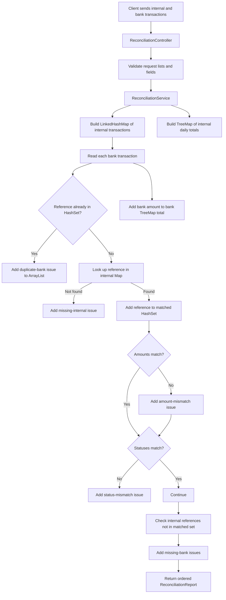

# Fintech Collections Reconciliation Sample

A standalone Spring Boot application that demonstrates practical Java Collections in a realistic fintech bank-reconciliation workflow.

The project is designed for interview preparation and hands-on learning. It shows how a developer with around four years of experience can explain:

- where collections were used in a project;
- why a specific collection was selected;
- how `Map`, `Set`, `List`, and `TreeMap` solve different business problems;
- how the correct data structure improves performance;
- how duplicates, missing transactions, amount mismatches, and status mismatches are detected;
- how Big-O complexity changes when a map replaces nested loops;
- when `HashMap` is enough and when `ConcurrentHashMap` is required.

---

## 1. Business Scenario

A payment company maintains an internal transaction ledger. At the end of a settlement cycle, a bank sends a settlement file.

The company must compare both sources and answer:

- Does every bank transaction exist internally?
- Does every internal transaction appear in the bank file?
- Are any transaction references duplicated?
- Do amounts match?
- Do statuses match?
- What is the total settled amount for each date?

This comparison process is called **reconciliation**.

Reconciliation is important because a mismatch can indicate:

- a failed settlement;
- duplicate processing;
- data corruption;
- delayed processing;
- a mapping problem;
- an integration failure;
- an operational or financial loss.

---

## 2. Reconciliation Flow Diagram



---

## 3. Collection Usage at a Glance

| Collection | Where it is used | Why it is used |
|---|---|---|
| `LinkedHashMap<String, InternalTransaction>` | Internal transaction lookup | Fast average lookup by reference ID and preserves insertion order |
| `HashSet<String>` | Duplicate and matched-reference tracking | Fast average membership checking and automatic uniqueness |
| `ArrayList<ReconciliationIssue>` | Issue report | Efficient append operations and stable discovery order |
| `TreeMap<LocalDate, BigDecimal>` | Daily totals | Automatically keeps dates sorted |
| Immutable copies | Final response | Prevents callers from modifying completed results |

---

## 4. Why a Map Is Better Than Nested Loops

Assume there are:

```text
100,000 internal transactions
100,000 bank transactions
```

A nested-loop approach checks every bank transaction against many internal transactions:

```java
for (BankTransaction bank : bankTransactions) {
    for (InternalTransaction internal : internalTransactions) {
        if (bank.referenceId().equals(internal.referenceId())) {
            // compare
        }
    }
}
```

Worst-case comparisons can approach:

```text
100,000 x 100,000 = 10,000,000,000 comparisons
```

The map-based approach first indexes internal transactions:

```java
Map<String, InternalTransaction> internalByReference = new LinkedHashMap<>();
```

Then each bank reference can be found using:

```java
InternalTransaction internal = internalByReference.get(bank.referenceId());
```

Average complexity becomes approximately:

```text
O(n + m)
```

Instead of:

```text
O(n x m)
```

This is the key practical reason collections matter in batch-processing and fintech reconciliation.

---

## 5. Technology Stack

- Java 21
- Spring Boot 4.1.0
- Spring Web
- Jakarta Bean Validation
- Maven
- JUnit 5
- AssertJ

This project intentionally has no database dependency. It focuses only on the collection-processing logic. In production, the transaction lists may come from database queries, object storage, Kafka, SFTP files, or external settlement APIs.

---

## 6. Project Structure

```text
fintech-collections-reconciliation/
├── pom.xml
├── README.md
├── requests.http
├── Dockerfile
├── .gitignore
└── src
    ├── main
    │   ├── java/com/example/fintech
    │   │   ├── CollectionsReconciliationApplication.java
    │   │   ├── common
    │   │   │   ├── ApiError.java
    │   │   │   └── GlobalExceptionHandler.java
    │   │   └── reconciliation
    │   │       ├── controller
    │   │       │   └── ReconciliationController.java
    │   │       ├── dto
    │   │       │   ├── BankTransaction.java
    │   │       │   ├── InternalTransaction.java
    │   │       │   ├── ReconciliationIssue.java
    │   │       │   ├── ReconciliationReport.java
    │   │       │   └── ReconciliationRequest.java
    │   │       ├── model
    │   │       │   ├── IssueType.java
    │   │       │   └── TransactionStatus.java
    │   │       └── service
    │   │           └── ReconciliationService.java
    │   └── resources
    │       └── application.yml
    └── test
        └── java/com/example/fintech/reconciliation/service
            └── ReconciliationServiceTest.java
```

---

# 7. File-by-File Code Explanation

## 7.1 `CollectionsReconciliationApplication.java`

```java
@SpringBootApplication
public class CollectionsReconciliationApplication {

    public static void main(String[] args) {
        SpringApplication.run(
                CollectionsReconciliationApplication.class,
                args
        );
    }
}
```

This starts the Spring Boot application.

Because it is located in `com.example.fintech`, Spring scans all controller, service, and advice classes underneath that package.

---

## 7.2 `pom.xml`

### `spring-boot-starter-web`

Provides the REST controller, embedded server, and JSON serialization.

### `spring-boot-starter-validation`

Validates transaction lists and individual transaction fields.

### `spring-boot-starter-test`

Provides JUnit, AssertJ, Spring Test, and Mockito.

The project does not use JPA because reconciliation processing is performed entirely on the request data. This keeps the example focused on Java Collections.

---

## 7.3 `InternalTransaction.java`

```java
public record InternalTransaction(
        @NotBlank String referenceId,
        @NotNull @PositiveOrZero BigDecimal amount,
        @NotNull LocalDate settlementDate,
        @NotNull TransactionStatus status
) {
}
```

This record represents the transaction stored in the company's internal ledger.

Fields:

- `referenceId` — the unique business reference used to match systems;
- `amount` — transaction value;
- `settlementDate` — date used for daily totals;
- `status` — `SETTLED`, `FAILED`, or `PENDING`.

`BigDecimal` is used for money because `double` can introduce binary floating-point precision issues.

---

## 7.4 `BankTransaction.java`

This record has the same comparison fields as `InternalTransaction`, but it represents data received from the bank settlement source.

Keeping separate types is useful even when fields are currently similar because the two systems may evolve differently. For example, a future bank record could include settlement batch ID, bank fee, settlement currency, or file row number.

---

## 7.5 `TransactionStatus.java`

```java
public enum TransactionStatus {
    SETTLED,
    FAILED,
    PENDING
}
```

An enum prevents arbitrary status strings and makes status comparison type-safe.

The code can use:

```java
internal.status() != bank.status()
```

Enum constants are single instances, so identity comparison is safe.

---

## 7.6 `IssueType.java`

```java
public enum IssueType {
    DUPLICATE_INTERNAL_REFERENCE,
    DUPLICATE_BANK_REFERENCE,
    MISSING_INTERNAL_TRANSACTION,
    MISSING_BANK_TRANSACTION,
    AMOUNT_MISMATCH,
    STATUS_MISMATCH
}
```

A structured issue type is better than storing only free-text messages because operations systems can:

- filter by issue category;
- count issue types;
- trigger different workflows;
- create dashboards;
- assign severity levels;
- generate alerts.

---

## 7.7 `ReconciliationRequest.java`

```java
public record ReconciliationRequest(
        @NotEmpty List<@Valid InternalTransaction> internalTransactions,
        @NotEmpty List<@Valid BankTransaction> bankTransactions
) {
}
```

`@NotEmpty` ensures both sides contain transactions.

`List<@Valid ...>` validates every object inside each list, not only the list itself.

---

## 7.8 `ReconciliationController.java`

```java
@PostMapping
public ReconciliationReport reconcile(
        @Valid @RequestBody ReconciliationRequest request
) {
    return reconciliationService.reconcile(request);
}
```

The controller is deliberately thin. It handles HTTP and delegates all collection logic to the service.

This separation makes `ReconciliationService` easy to unit test without starting the web server.

---

# 8. `ReconciliationService` Detailed Explanation

The service performs the complete comparison in three phases:

```text
Phase 1: index internal transactions
Phase 2: process bank transactions
Phase 3: find internal transactions missing from the bank file
```

---

## 8.1 Internal Lookup Map

```java
Map<String, InternalTransaction> internalByReference =
        new LinkedHashMap<>();
```

### Why a map?

The business question is:

```text
For this bank reference ID, where is the internal transaction?
```

A map represents exactly this relationship:

```text
reference ID -> internal transaction
```

### Why `LinkedHashMap` instead of `HashMap`?

Both provide average constant-time lookup.

`LinkedHashMap` also keeps insertion order. This gives deterministic output when the service later walks through internal references to find missing bank records.

Deterministic order helps:

- tests;
- logs;
- operations reports;
- debugging;
- repeated processing of the same file.

### Insert without overwriting the first value

```java
InternalTransaction previous = internalByReference.putIfAbsent(
        internal.referenceId(),
        internal
);
```

`putIfAbsent()` inserts the value only when the key does not already exist.

If a duplicate internal reference appears, the first transaction remains the comparison record and the duplicate is reported.

---

## 8.2 Duplicate Internal Reference Set

```java
Set<String> duplicateInternalReferences = new HashSet<>();
```

This set prevents the report from adding the same duplicate-internal issue repeatedly.

```java
if (previous != null &&
        duplicateInternalReferences.add(internal.referenceId())) {
    issues.add(...);
}
```

The `Set.add()` return value is useful:

```text
true  -> the value was newly added
false -> the value already existed
```

This combines membership checking and insertion in one operation.

---

## 8.3 Processed Bank Reference Set

```java
Set<String> processedBankReferences = new HashSet<>();
```

For each bank transaction:

```java
if (!processedBankReferences.add(bank.referenceId())) {
    issues.add(new ReconciliationIssue(
            bank.referenceId(),
            IssueType.DUPLICATE_BANK_REFERENCE,
            "The bank settlement file contains the reference more than once"
    ));
    continue;
}
```

The first occurrence is added successfully.

The second occurrence returns `false`, so the transaction is marked as a duplicate and skipped from normal matching.

### Why `HashSet`?

A set models unique values. Average lookup and insertion are `O(1)`.

Using a `List` for duplicate tracking would require searching the list each time, which is slower for large inputs.

---

## 8.4 Matched Reference Set

```java
Set<String> matchedReferences = new HashSet<>();
```

When a bank transaction finds an internal match:

```java
matchedReferences.add(bank.referenceId());
```

After all bank transactions are processed, the service checks every internal reference:

```java
for (String internalReference : internalByReference.keySet()) {
    if (!matchedReferences.contains(internalReference)) {
        // internal transaction is missing from bank file
    }
}
```

This avoids modifying the internal map while iterating and clearly separates matching from missing-record detection.

---

## 8.5 Issue List

```java
List<ReconciliationIssue> issues = new ArrayList<>();
```

### Why `ArrayList`?

The service mainly appends issues and later returns them in discovery order.

`ArrayList` is a good choice because:

- adding to the end is amortized `O(1)`;
- indexed access is `O(1)`;
- iteration is cache-friendly;
- it preserves insertion order;
- no frequent insertion at the beginning is required.

A `LinkedList` would add node memory overhead and does not provide a benefit for this access pattern.

---

## 8.6 Daily Totals With `TreeMap`

```java
Map<LocalDate, BigDecimal> internalTotalsByDate = new TreeMap<>();
Map<LocalDate, BigDecimal> bankTotalsByDate = new TreeMap<>();
```

The report needs totals ordered by date.

A `TreeMap` keeps keys sorted according to their natural order. `LocalDate` has a chronological natural order.

Amounts are accumulated with `merge()`:

```java
totals.merge(settlementDate, amount, BigDecimal::add);
```

`merge()` means:

```text
If date is absent: store amount.
If date exists: replace old total with old total + amount.
```

Equivalent longer code would be:

```java
BigDecimal current = totals.get(settlementDate);
if (current == null) {
    totals.put(settlementDate, amount);
} else {
    totals.put(settlementDate, current.add(amount));
}
```

`merge()` expresses the accumulation more clearly.

### Complexity

`TreeMap` insertion is `O(log d)`, where `d` is the number of distinct dates.

A `HashMap` would have average `O(1)` insertion but would require sorting later. `TreeMap` is selected because ordered dates are part of the output requirement.

---

## 8.7 Missing Internal Transaction

```java
InternalTransaction internal =
        internalByReference.get(bank.referenceId());

if (internal == null) {
    issues.add(new ReconciliationIssue(
            bank.referenceId(),
            IssueType.MISSING_INTERNAL_TRANSACTION,
            "Transaction exists in the bank file but not in the internal ledger"
    ));
    continue;
}
```

A missing map value means the bank settled a reference that the internal ledger does not know about.

This may require investigation because it can indicate an ingestion, mapping, or processing problem.

---

## 8.8 Amount Comparison

```java
if (internal.amount().compareTo(bank.amount()) != 0) {
    issues.add(...);
}
```

`BigDecimal.compareTo()` compares numeric value.

This is preferred for monetary equality because:

```java
new BigDecimal("100.0").equals(new BigDecimal("100.00"))
```

is `false` due to different scale, while:

```java
new BigDecimal("100.0").compareTo(new BigDecimal("100.00")) == 0
```

is `true` because the numeric amounts are equal.

---

## 8.9 Status Comparison

```java
if (internal.status() != bank.status()) {
    issues.add(new ReconciliationIssue(
            bank.referenceId(),
            IssueType.STATUS_MISMATCH,
            "Internal status " + internal.status() +
                    " does not match bank status " + bank.status()
    ));
}
```

Example mismatch:

```text
Internal: PENDING
Bank: SETTLED
```

This may mean the bank completed settlement but the internal system did not process the status update.

---

## 8.10 Missing Bank Transaction

After the bank side is processed, the service checks internal references that were never matched:

```java
for (String internalReference : internalByReference.keySet()) {
    if (!matchedReferences.contains(internalReference)) {
        issues.add(new ReconciliationIssue(
                internalReference,
                IssueType.MISSING_BANK_TRANSACTION,
                "Transaction exists internally but not in the bank settlement file"
        ));
    }
}
```

This identifies transactions that the internal system expected to settle but the bank file did not contain.

---

## 8.11 Immutable Result Copies

```java
return new ReconciliationReport(
        request.internalTransactions().size(),
        request.bankTransactions().size(),
        issues.size(),
        List.copyOf(issues),
        Collections.unmodifiableMap(new TreeMap<>(internalTotalsByDate)),
        Collections.unmodifiableMap(new TreeMap<>(bankTotalsByDate))
);
```

The service does not return its mutable working collections directly.

### Why copy them?

If another caller received the same mutable list or map, it could accidentally modify the completed report.

`List.copyOf()` creates an unmodifiable snapshot.

The maps are copied into new `TreeMap` objects and wrapped as unmodifiable maps, preserving sorted order while protecting the result.

---

# 9. Full Algorithm in Plain Language

```text
1. Create an empty lookup map for internal transactions.
2. Create sets for duplicate detection and match tracking.
3. Create a list for issues.
4. Create sorted maps for daily totals.
5. Read internal transactions:
   a. Add amount to internal daily total.
   b. Add reference and transaction to lookup map.
   c. Report duplicate internal references.
6. Read bank transactions:
   a. Add amount to bank daily total.
   b. Report duplicate bank references.
   c. Look up the reference in the internal map.
   d. Report missing internal transaction when no match exists.
   e. Mark the reference as matched.
   f. Compare amount.
   g. Compare status.
7. Read internal map keys:
   a. Any reference not in the matched set is missing from the bank file.
8. Return counts, issues, and sorted totals.
```

---

# 10. Complexity Analysis

Let:

```text
n = number of internal transactions
m = number of bank transactions
d = number of distinct settlement dates
```

### Internal indexing

Each internal record is processed once.

- map operation: average `O(1)`;
- set operation: average `O(1)`;
- `TreeMap` total update: `O(log d)`.

Approximate phase cost:

```text
O(n log d)
```

### Bank processing

Each bank record is processed once.

- duplicate set: average `O(1)`;
- internal map lookup: average `O(1)`;
- matched set: average `O(1)`;
- `TreeMap` total update: `O(log d)`.

Approximate phase cost:

```text
O(m log d)
```

### Missing-bank scan

Every unique internal reference is checked once:

```text
O(n)
```

### Overall

```text
O((n + m) log d)
```

Because the number of settlement dates is usually much smaller than the number of transactions, this behaves close to linear processing for typical reconciliation files.

### Space complexity

The map, sets, issues, and totals require additional memory:

```text
O(n + m)
```

For files too large to fit in memory, production solutions may partition by date or account, stream sorted files, use database joins, or process chunks.

---

# 11. How to Run the Project

## Prerequisites

- Java 21
- Maven 3.9 or later

Check installations:

```bash
java -version
mvn -version
```

## Run from the command line

```bash
cd fintech-collections-reconciliation
mvn clean spring-boot:run
```

The application starts on:

```text
http://localhost:8082
```

## Build a JAR

```bash
mvn clean package
java -jar target/fintech-collections-reconciliation-0.0.1-SNAPSHOT.jar
```

## Run with Docker

```bash
docker build -t fintech-collections-reconciliation .
docker run --rm -p 8082:8082 fintech-collections-reconciliation
```

---

# 12. API Example

A ready-to-use `requests.http` file is included.

```http
POST http://localhost:8082/api/reconciliation
Content-Type: application/json

{
  "internalTransactions": [
    {
      "referenceId": "TXN-1001",
      "amount": 100.00,
      "settlementDate": "2026-07-16",
      "status": "SETTLED"
    },
    {
      "referenceId": "TXN-1002",
      "amount": 200.00,
      "settlementDate": "2026-07-16",
      "status": "SETTLED"
    },
    {
      "referenceId": "TXN-1004",
      "amount": 400.00,
      "settlementDate": "2026-07-17",
      "status": "PENDING"
    }
  ],
  "bankTransactions": [
    {
      "referenceId": "TXN-1001",
      "amount": 100.00,
      "settlementDate": "2026-07-16",
      "status": "SETTLED"
    },
    {
      "referenceId": "TXN-1002",
      "amount": 250.00,
      "settlementDate": "2026-07-16",
      "status": "SETTLED"
    },
    {
      "referenceId": "TXN-1003",
      "amount": 300.00,
      "settlementDate": "2026-07-17",
      "status": "SETTLED"
    },
    {
      "referenceId": "TXN-1003",
      "amount": 300.00,
      "settlementDate": "2026-07-17",
      "status": "SETTLED"
    }
  ]
}
```

Expected issue categories:

```text
TXN-1002 -> AMOUNT_MISMATCH
TXN-1003 -> MISSING_INTERNAL_TRANSACTION
TXN-1003 -> DUPLICATE_BANK_REFERENCE
TXN-1004 -> MISSING_BANK_TRANSACTION
```

Example response shape:

```json
{
  "internalTransactionCount": 3,
  "bankTransactionCount": 4,
  "issueCount": 4,
  "issues": [
    {
      "referenceId": "TXN-1002",
      "issueType": "AMOUNT_MISMATCH",
      "description": "Internal amount 200.00 does not match bank amount 250.00"
    },
    {
      "referenceId": "TXN-1003",
      "issueType": "MISSING_INTERNAL_TRANSACTION",
      "description": "Transaction exists in the bank file but not in the internal ledger"
    },
    {
      "referenceId": "TXN-1003",
      "issueType": "DUPLICATE_BANK_REFERENCE",
      "description": "The bank settlement file contains the reference more than once"
    },
    {
      "referenceId": "TXN-1004",
      "issueType": "MISSING_BANK_TRANSACTION",
      "description": "Transaction exists internally but not in the bank settlement file"
    }
  ],
  "internalTotalsByDate": {
    "2026-07-16": 300.00,
    "2026-07-17": 400.00
  },
  "bankTotalsByDate": {
    "2026-07-16": 350.00,
    "2026-07-17": 600.00
  }
}
```

The duplicate bank record is included in the raw bank daily total because it exists in the received file. A production report may also return a separate deduplicated total, depending on business requirements.

---

# 13. Request Validation

Invalid input is rejected before reconciliation starts.

Examples:

- empty internal list;
- empty bank list;
- blank reference ID;
- missing settlement date;
- missing status;
- negative amount.

`GlobalExceptionHandler` converts field errors into a consistent JSON response.

---

# 14. Tests

Run:

```bash
mvn test
```

`ReconciliationServiceTest` creates a controlled dataset and verifies that the service detects:

- amount mismatch;
- missing internal transaction;
- duplicate bank reference;
- missing bank transaction.

The test directly creates `ReconciliationService`:

```java
private final ReconciliationService service =
        new ReconciliationService();
```

This is a true unit test because the service has no external dependency and does not need the Spring context.

---

# 15. `HashMap` vs `LinkedHashMap` vs `TreeMap`

## `HashMap`

Use when:

- fast key lookup is required;
- output order does not matter;
- the map is not shared unsafely across threads.

Average lookup and insertion are `O(1)`.

## `LinkedHashMap`

Use when:

- fast key lookup is required;
- insertion order should be preserved.

This project uses it for internal transactions so missing-bank issues follow the original internal input order.

## `TreeMap`

Use when:

- keys must remain sorted;
- `O(log n)` operations are acceptable.

This project uses it for chronological daily totals.

---

# 16. `HashSet` vs `List` for Duplicate Detection

A list-based approach might use:

```java
if (processedReferences.contains(referenceId)) {
    // duplicate
}
processedReferences.add(referenceId);
```

`List.contains()` is `O(n)`.

A set uses average `O(1)` membership checking:

```java
if (!processedReferences.add(referenceId)) {
    // duplicate
}
```

The set also communicates the business rule clearly: reference IDs should be unique.

---

# 17. `HashMap` vs `ConcurrentHashMap`

The map in this service is a local variable:

```java
Map<String, InternalTransaction> internalByReference =
        new LinkedHashMap<>();
```

Each HTTP request receives its own service-method call and its own local collections. They are not shared between requests, so a concurrent map is unnecessary.

Use `ConcurrentHashMap` when multiple threads intentionally read and modify the same map instance.

Example shared processing-state map:

```java
private final Map<String, ProcessingStatus> statuses =
        new ConcurrentHashMap<>();
```

Atomic update example:

```java
statuses.compute(referenceId, (key, current) -> ProcessingStatus.RUNNING);
```

### Important limitation

`ConcurrentHashMap` protects the in-memory map structure. It does not provide:

- database transactions;
- persistence after restart;
- sharing across application instances;
- financial ledger guarantees.

For durable business data, use a database, distributed cache with defined consistency, or another persistent system.

---

# 18. Why This Project Does Not Use Multithreading

This reconciliation request is processed sequentially on purpose.

The method mutates several related working collections:

- internal lookup map;
- duplicate sets;
- matched set;
- issue list;
- daily totals.

Parallelizing the loops would add synchronization and merging complexity. For moderate request sizes, a linear single-threaded pass is simple and efficient.

A four-year engineer should explain that selecting the right algorithm and collection is often more valuable than adding threads.

For very large independent files, parallel processing could be introduced by:

- partitioning records;
- using thread-local maps and lists;
- merging partial results;
- defining duplicate behavior across partitions;
- controlling memory and executor size;
- preserving deterministic output.

---

# 19. Benefits of This Design

## Fast reference lookup

The internal map avoids repeated scans of the full internal list.

## Efficient duplicate detection

Sets provide fast uniqueness checks.

## Deterministic reporting

`LinkedHashMap` and `ArrayList` preserve meaningful order.

## Naturally sorted totals

`TreeMap` keeps daily results chronological.

## Clear responsibilities

The controller handles HTTP while the service handles reconciliation logic.

## Easy testing

The service has no external dependency and can be instantiated directly.

## Safer output

Immutable copies prevent accidental report modification.

---

# 20. Production Considerations

## File size and memory

The sample receives both lists in one HTTP request. Large settlement files may not fit safely in memory.

Production alternatives include:

- streaming CSV processing;
- chunk-based processing;
- staging tables and SQL joins;
- object-storage events;
- Spring Batch;
- partitioning by settlement date;
- external sorting for very large datasets.

## Duplicate policy

The business must define whether to:

- keep the first occurrence;
- keep the last occurrence;
- reject the entire file;
- total duplicates separately;
- send duplicates to manual review.

This sample keeps the first internal record and reports later duplicates.

## Currency

Transactions should include currency. Amounts from different currencies must never be totaled together without explicit conversion rules.

## Rounding

Currency-specific scale and rounding rules should be defined.

## Audit information

Production issues may include source filename, batch ID, row number, received time, account, merchant, severity, and investigation status.

## Data normalization

Reference IDs may need trimming, case normalization, prefix mapping, or format validation before matching.

## Security

Settlement files and issue reports may contain sensitive financial information and require encryption, access control, retention rules, and audit logging.

---

# 21. Four-Year-Experience Interview Answer

> In a fintech reconciliation module, I compared our internal ledger records with bank settlement records. I first loaded internal transactions into a `LinkedHashMap` using the transaction reference as the key. This gave average constant-time lookup and preserved the original input order for deterministic reporting. I used `HashSet` for duplicate detection and to track matched references, `ArrayList` to collect reconciliation issues in discovery order, and `TreeMap` to maintain daily settlement totals in date order.
>
> The map-based design replaced nested list scans. Instead of approaching `O(n x m)`, the matching flow processes both collections close to linearly, with a small `TreeMap` sorting cost for settlement dates. I used `BigDecimal.compareTo()` for amount comparison, returned immutable result copies, and kept the collections local to the request because they were not shared between threads. For very large files, I would move to chunking, staging tables, or Spring Batch rather than loading everything into one request.

---

# 22. Common Interview Follow-Up Questions

## Why did you use `LinkedHashMap` instead of `HashMap`?

Both provide fast average lookup, but `LinkedHashMap` preserves insertion order. This makes the report deterministic and easier for operations teams to compare with the source file.

## Why not use `TreeMap` for every lookup?

The reference-ID lookup does not require sorted keys. `TreeMap` would add `O(log n)` cost without a business benefit. It is used only where sorting by date is required.

## Why use `ArrayList` instead of `LinkedList`?

The service mainly appends and iterates. `ArrayList` is memory-efficient and provides fast sequential access. There are no frequent insertions at the beginning or middle that would justify a linked structure.

## How are duplicate references detected?

`HashSet.add()` returns `false` when the reference already exists. This performs the membership check and insert in one operation.

## Why not use Java Streams for everything?

Streams can be useful for transformations, but the reconciliation algorithm maintains several related collections and creates multiple issue types in one pass. A clear loop makes the state transitions, duplicate policy, and business branches easier to understand and debug.

## Is this service thread-safe?

Yes for normal Spring usage because every mutable collection is created inside the method. Each request has separate local objects. The service does not store mutable request state in instance fields.

## What would make it unsafe?

Storing a shared mutable `HashMap` or `ArrayList` as a singleton service field and modifying it from multiple request threads without synchronization.

## How would you process ten million records?

I would avoid loading both files fully into an HTTP request. I would consider staging tables with indexed joins, Spring Batch chunks, partitioned processing, sorted streaming merge, or distributed processing depending on file size and SLA.

---

# 23. Suggested Enhancements

- Add currency to transaction records.
- Return deduplicated and raw daily totals separately.
- Add settlement batch and source-file metadata.
- Add issue severity and resolution status.
- Export reports as CSV.
- Add Spring Batch for chunk processing.
- Add PostgreSQL staging tables and indexed reconciliation queries.
- Add metrics for processed records, issue counts, and processing duration.
- Add property-based tests for random transaction sets.
- Add normalization rules for reference IDs.
- Add pagination or external report storage for large issue lists.

---

## Summary

This project demonstrates how collection selection directly supports business requirements:

```text
Map      -> find a transaction quickly by reference ID
Set      -> enforce and check uniqueness
List     -> keep an ordered issue report
TreeMap  -> keep totals sorted by date
```

The main engineering lesson is:

```text
Choose the data structure based on lookup, uniqueness, ordering,
mutation, memory, and concurrency requirements—not by habit.
```
