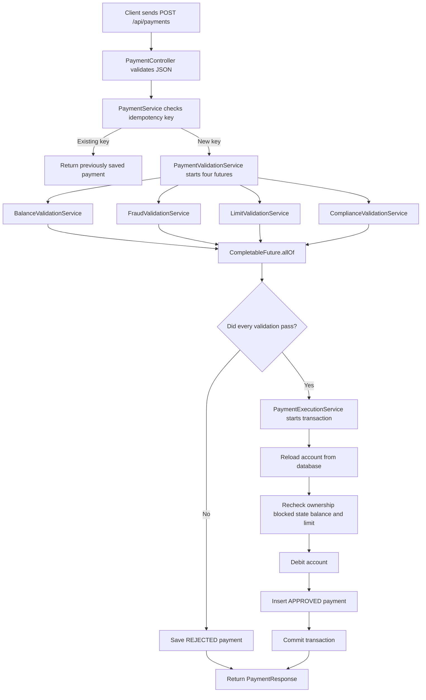
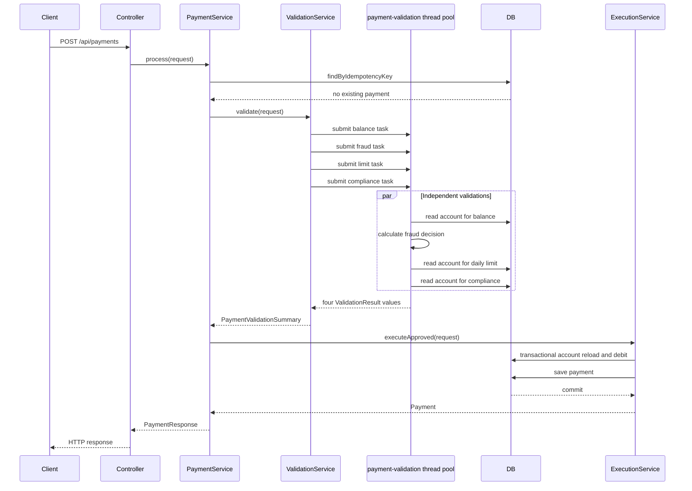

# Fintech Payment Multithreading Sample

A standalone Spring Boot application that demonstrates how multithreading can be used safely in a realistic fintech payment workflow.

The project is designed for interview preparation and hands-on learning. It shows how a developer with around four years of experience can explain:

- where multithreading was used in a project;
- why the operations were executed in parallel;
- how `CompletableFuture` combines independent tasks;
- why a custom bounded thread pool is safer than creating threads manually;
- how timeouts and failures are handled;
- why the actual account debit remains synchronous and transactional;
- how optimistic locking protects the same account from concurrent updates;
- how idempotency prevents a retry from charging the customer twice.

---

## 1. Business Scenario

A customer submits a payment. Before approving the payment, the service must perform four checks:

1. **Balance check** — does the account have enough money?
2. **Fraud check** — does the merchant or payment amount look risky?
3. **Daily-limit check** — will this payment exceed the account's daily limit?
4. **Compliance check** — is the account blocked?

The four checks are independent read operations. Therefore, they can run at the same time.

The final debit is different. It changes financial data, so it must execute inside one database transaction.

---

## 2. Why Multithreading Is Useful Here

The sample gives each validation a simulated delay:

| Validation | Simulated time |
|---|---:|
| Balance | 200 ms |
| Fraud | 700 ms |
| Daily limit | 350 ms |
| Compliance | 600 ms |

If the application runs them one after another, the approximate total is:

```text
200 + 700 + 350 + 600 = 1,850 ms
```

When they run concurrently, the total is close to the slowest operation:

```text
approximately 700 ms plus small framework and database overhead
```

This is useful when validations call independent databases, fraud APIs, compliance APIs, or customer-profile services.

---

## 3. Complete Payment Flow



---

## 4. Thread Execution Flow



---

## 5. Technology Stack

- Java 21
- Spring Boot 4.1.0
- Spring Web
- Spring Data JPA
- Jakarta Bean Validation
- H2 in-memory database
- Maven
- JUnit 5
- AssertJ

Spring Boot `4.1.0` is selected for this sample project. It does not mean every existing project must immediately upgrade to this version. In a real company, the version is chosen based on organization standards, dependency compatibility, security support, and upgrade testing.

---

## 6. Project Structure

```text
fintech-payment-multithreading/
├── pom.xml
├── README.md
├── requests.http
├── Dockerfile
├── .gitignore
└── src
    ├── main
    │   ├── java/com/example/fintech
    │   │   ├── PaymentMultithreadingApplication.java
    │   │   ├── bootstrap
    │   │   │   └── SampleDataInitializer.java
    │   │   ├── common
    │   │   │   ├── ApiError.java
    │   │   │   └── GlobalExceptionHandler.java
    │   │   ├── config
    │   │   │   └── PaymentExecutorConfiguration.java
    │   │   └── payment
    │   │       ├── controller
    │   │       │   ├── AccountController.java
    │   │       │   └── PaymentController.java
    │   │       ├── dto
    │   │       │   ├── AccountResponse.java
    │   │       │   ├── PaymentRequest.java
    │   │       │   ├── PaymentResponse.java
    │   │       │   ├── PaymentValidationSummary.java
    │   │       │   └── ValidationResult.java
    │   │       ├── entity
    │   │       │   ├── Account.java
    │   │       │   └── Payment.java
    │   │       ├── model
    │   │       │   └── PaymentStatus.java
    │   │       ├── repository
    │   │       │   ├── AccountRepository.java
    │   │       │   └── PaymentRepository.java
    │   │       └── service
    │   │           ├── BalanceValidationService.java
    │   │           ├── ComplianceValidationService.java
    │   │           ├── FraudValidationService.java
    │   │           ├── LatencySimulator.java
    │   │           ├── LimitValidationService.java
    │   │           ├── PaymentExecutionService.java
    │   │           ├── PaymentService.java
    │   │           └── PaymentValidationService.java
    │   └── resources
    │       └── application.yml
    └── test
        └── java/com/example/fintech/payment/service
            ├── PaymentServiceTest.java
            └── PaymentValidationServiceTest.java
```

---

# 7. File-by-File Code Explanation

## 7.1 `PaymentMultithreadingApplication.java`

```java
@SpringBootApplication
public class PaymentMultithreadingApplication {

    public static void main(String[] args) {
        SpringApplication.run(PaymentMultithreadingApplication.class, args);
    }
}
```

This is the application entry point.

`@SpringBootApplication` combines:

- `@Configuration` — allows Spring configuration;
- `@EnableAutoConfiguration` — configures Spring components based on dependencies;
- `@ComponentScan` — scans classes under `com.example.fintech`.

Because the main class is in `com.example.fintech`, Spring automatically discovers the controllers, services, repositories, entities, configuration, and exception handler under that package.

---

## 7.2 `pom.xml`

The important dependencies are:

### `spring-boot-starter-web`

Used for REST controllers, JSON serialization, HTTP requests, and the embedded web server.

### `spring-boot-starter-data-jpa`

Used for entities, repositories, transactions, optimistic locking, and database access.

### `spring-boot-starter-validation`

Used to validate the payment request before business logic runs.

### `h2`

Provides an in-memory database so the project runs without installing PostgreSQL or MySQL.

### `spring-boot-starter-test`

Provides JUnit, AssertJ, Spring Test, Mockito, and test utilities.

---

## 7.3 `PaymentExecutorConfiguration.java`

```java
@Bean(name = "paymentValidationExecutor")
public Executor paymentValidationExecutor() {
    ThreadPoolTaskExecutor executor = new ThreadPoolTaskExecutor();
    executor.setCorePoolSize(4);
    executor.setMaxPoolSize(8);
    executor.setQueueCapacity(100);
    executor.setThreadNamePrefix("payment-validation-");
    executor.setRejectedExecutionHandler(
            new ThreadPoolExecutor.CallerRunsPolicy()
    );
    executor.setWaitForTasksToCompleteOnShutdown(true);
    executor.setAwaitTerminationSeconds(10);
    executor.initialize();
    return executor;
}
```

### Why a custom executor is used

Calling `CompletableFuture.supplyAsync()` without an executor uses the JVM common pool. That pool is shared by unrelated application work, which makes performance and resource usage harder to control.

A named custom executor isolates the payment-validation workload.

### Meaning of each property

| Setting | Purpose |
|---|---|
| `corePoolSize(4)` | Keeps four worker threads available. The sample has four validations. |
| `maxPoolSize(8)` | Allows controlled growth when traffic increases. |
| `queueCapacity(100)` | Holds waiting tasks instead of creating unlimited threads. |
| `threadNamePrefix` | Makes logs show which work ran on validation threads. |
| `CallerRunsPolicy` | Applies backpressure when the pool and queue are full. |
| `waitForTasksToCompleteOnShutdown` | Avoids immediately abandoning submitted tasks during shutdown. |
| `awaitTerminationSeconds(10)` | Gives running work time to complete during shutdown. |

### Why `new Thread()` is not used

Creating a new thread for every validation would cause:

- uncontrolled memory usage;
- more context switching;
- no bounded task queue;
- difficult monitoring;
- difficult shutdown handling;
- possible database and downstream-service overload.

A thread pool reuses a controlled number of worker threads.

---

## 7.4 `PaymentRequest.java`

```java
public record PaymentRequest(
        @NotBlank @Size(max = 80) String idempotencyKey,
        @NotNull Long customerId,
        @NotNull Long accountId,
        @NotNull @Positive BigDecimal amount,
        @NotBlank @Size(max = 80) String merchantId
) {
}
```

A Java record is used because this object only carries request data.

Validation rules prevent invalid data from reaching the payment services:

- the idempotency key is required;
- customer and account IDs are required;
- the amount must be positive;
- the merchant ID is required;
- text lengths are limited.

`BigDecimal` is used instead of `double` because decimal financial amounts should not use binary floating-point arithmetic.

---

## 7.5 `PaymentController.java`

```java
@PostMapping
public ResponseEntity<PaymentResponse> processPayment(
        @Valid @RequestBody PaymentRequest request
) {
    return ResponseEntity.ok(paymentService.process(request));
}
```

The controller has only HTTP responsibilities:

1. receive JSON;
2. convert it into `PaymentRequest`;
3. trigger validation with `@Valid`;
4. call the service;
5. return the response.

The controller does not contain fraud rules, balance calculations, thread management, or database logic. Keeping the controller thin makes it easier to test and maintain.

---

## 7.6 `PaymentService.java`

`PaymentService` is the orchestration layer.

Its flow is:

```text
check idempotency
      |
      +-- existing payment -> return previous result
      |
      +-- new request -> run validations
                             |
                             +-- pass -> execute debit
                             +-- fail -> save rejection
```

Important code:

```java
Payment existingPayment = paymentRepository
        .findByIdempotencyKey(request.idempotencyKey())
        .orElse(null);

if (existingPayment != null) {
    return toResponse(existingPayment, true, 0, List.of());
}

PaymentValidationSummary summary = paymentValidationService.validate(request);

Payment payment = summary.allValid()
        ? paymentExecutionService.executeApproved(request)
        : paymentExecutionService.recordRejected(
                request,
                summary.rejectionReason()
        );
```

### Why this class exists

Without an orchestration service, the controller would need to know too much about idempotency, validations, approval, rejection, and response mapping.

`PaymentService` coordinates these components but delegates the actual work to focused services.

---

## 7.7 Idempotency

Clients retry requests when they do not receive a response because of a network timeout. The first request may already have completed.

Example:

```text
1. Client sends payment request.
2. Server approves and commits payment.
3. Network response is lost.
4. Client retries the request.
5. The system must return the original result, not charge again.
```

The project uses an idempotency key in two places:

### Application lookup

```java
Optional<Payment> findByIdempotencyKey(String idempotencyKey);
```

### Database unique constraint

```java
@Table(
    name = "payments",
    uniqueConstraints = @UniqueConstraint(
        name = "uk_payment_idempotency_key",
        columnNames = "idempotency_key"
    )
)
```

The application lookup makes normal retries fast. The database constraint remains the final protection when concurrent requests use the same key.

In a distributed production system, an idempotency design may also store request hashes, processing states, response payloads, expiration rules, and ownership information.

---

## 7.8 `PaymentValidationService.java`

This is the main multithreading class.

### Step 1: submit independent tasks

```java
CompletableFuture<ValidationResult> balanceFuture = runAsync(
        "BALANCE",
        () -> balanceValidationService.validate(request)
);

CompletableFuture<ValidationResult> fraudFuture = runAsync(
        "FRAUD",
        () -> fraudValidationService.validate(request)
);

CompletableFuture<ValidationResult> limitFuture = runAsync(
        "DAILY_LIMIT",
        () -> limitValidationService.validate(request)
);

CompletableFuture<ValidationResult> complianceFuture = runAsync(
        "COMPLIANCE",
        () -> complianceValidationService.validate(request)
);
```

Each supplier is submitted to `paymentValidationExecutor`. The calling request thread does not execute the validations one by one.

### Step 2: wait for all checks

```java
CompletableFuture.allOf(
        balanceFuture,
        fraudFuture,
        limitFuture,
        complianceFuture
).join();
```

`allOf()` creates one future that completes after every supplied future completes.

It does not directly return the individual results, so the code reads each future after `allOf()` finishes.

### Step 3: collect results

```java
List<ValidationResult> results = List.of(
        balanceFuture.join(),
        fraudFuture.join(),
        limitFuture.join(),
        complianceFuture.join()
);
```

At this point the futures have already completed, so each `join()` returns the result immediately.

### Step 4: measure total time

```java
long totalElapsedMs = Duration.ofNanos(
        System.nanoTime() - startedAt
).toMillis();
```

`System.nanoTime()` is used for elapsed-time measurement because it is monotonic and is not affected by wall-clock changes.

---

## 7.9 Timeout and Exception Handling

```java
return CompletableFuture
        .supplyAsync(validation, paymentValidationExecutor)
        .orTimeout(2, TimeUnit.SECONDS)
        .exceptionally(exception -> ValidationResult.failure(
                validationType,
                "Validation unavailable: " + rootMessage(exception),
                0
        ));
```

### `orTimeout`

A payment request must not wait forever for a fraud or compliance dependency. The sample marks a validation as failed if it does not complete within two seconds.

### `exceptionally`

An exception is converted into a normal failed `ValidationResult`. This allows all validation results to be returned consistently.

For important fraud and compliance checks, this sample uses a **fail-closed** decision:

```text
validation unavailable -> do not approve the payment
```

A fail-open decision would approve a payment without completing the check, which can create financial and compliance risk.

### Production consideration

A timeout on a `CompletableFuture` does not guarantee that an underlying blocking database or HTTP operation is immediately cancelled. Production HTTP clients should also have connection, read, and response timeouts configured at the client level.

---

## 7.10 Validation Services

### `BalanceValidationService`

Responsibilities:

- load the account;
- verify the account exists;
- verify it belongs to the customer;
- verify enough balance is available.

```java
if (account.getAvailableBalance().compareTo(request.amount()) < 0) {
    return ValidationResult.failure(
            "BALANCE",
            "Insufficient available balance",
            duration
    );
}
```

`compareTo()` is used for `BigDecimal` comparison.

### `FraudValidationService`

This sample rejects:

- a merchant ID containing `RISK`;
- an amount greater than or equal to `5000.00`.

A production implementation would normally call a fraud engine that evaluates velocity, device signals, geolocation, merchant risk, account history, card behavior, and machine-learning features.

### `LimitValidationService`

It calculates projected daily spending:

```java
var projectedSpend = account
        .effectiveDailySpent(LocalDate.now())
        .add(request.amount());
```

It then compares the projected value with the daily limit.

### `ComplianceValidationService`

It rejects an account marked as blocked.

In a real system, this may represent sanctions screening, KYC status, account restrictions, geographic rules, or a compliance platform response.

### `LatencySimulator`

`Thread.sleep()` exists only to make the performance difference visible. It represents waiting for databases or external services.

It is package-private because it is only an internal helper for the service package.

---

## 7.11 `ValidationResult.java`

```java
public record ValidationResult(
        String validationType,
        boolean valid,
        String message,
        long durationMs,
        String threadName
) {
}
```

The result includes:

- which validation ran;
- whether it passed;
- the business message;
- how long it took;
- which thread executed it.

Returning the thread name makes the multithreading behavior visible in the API response and test.

Example:

```json
{
  "validationType": "FRAUD",
  "valid": true,
  "message": "Validation successful",
  "durationMs": 701,
  "threadName": "payment-validation-2"
}
```

---

## 7.12 `PaymentValidationSummary.java`

This object groups the four results and the total elapsed time.

```java
public boolean allValid() {
    return results.stream().allMatch(ValidationResult::valid);
}
```

`allMatch()` is appropriate because a payment is approved only when every required validation succeeds.

The rejection method joins all failed reasons so the stored payment decision is traceable.

---

## 7.13 `Account.java`

The account entity stores:

- account ID;
- customer ID;
- available balance;
- daily limit;
- today's spending;
- spending date;
- blocked status;
- optimistic-lock version.

### Domain method

```java
public void debit(BigDecimal amount, LocalDate today) {
    resetDailyWindowIfRequired(today);

    if (availableBalance.compareTo(amount) < 0) {
        throw new IllegalStateException("Insufficient available balance");
    }

    if (dailySpent.add(amount).compareTo(dailyLimit) > 0) {
        throw new IllegalStateException("Daily transaction limit exceeded");
    }

    availableBalance = availableBalance.subtract(amount);
    dailySpent = dailySpent.add(amount);
}
```

The business rule is placed in the entity so callers cannot directly subtract money without applying the balance and limit checks.

---

## 7.14 Optimistic Locking With `@Version`

```java
@Version
private Long version;
```

Suppose the balance is `$1,000` and two requests arrive together:

```text
Request A wants $700.
Request B wants $600.
```

Both could initially read `$1,000`. Without concurrency control, both might try to succeed.

With optimistic locking, the database update includes the entity version.

Conceptually:

```sql
UPDATE accounts
SET available_balance = ?, version = version + 1
WHERE id = ? AND version = ?;
```

Only one update can match the original version. The other request receives an optimistic-lock conflict and can be retried or rejected safely.

### Why optimistic locking is suitable for this sample

It works well when conflicts are possible but not expected on every operation. It avoids holding a database lock during the earlier external validations.

A high-contention ledger may use a different strategy, such as atomic SQL updates, pessimistic locking, serialized processing by account, or a dedicated ledger service.

---

## 7.15 `PaymentExecutionService.java`

```java
@Transactional
public Payment executeApproved(PaymentRequest request) {
    Account account = accountRepository.findById(request.accountId())
            .orElseThrow(...);

    // Final business checks happen again here.
    account.debit(request.amount(), LocalDate.now());

    Payment payment = Payment.approved(...);

    accountRepository.saveAndFlush(account);
    return paymentRepository.saveAndFlush(payment);
}
```

### Why validations are repeated inside the transaction

The parallel validations are snapshots. Between validation and debit, another request may modify the account.

Therefore, the write transaction is the final consistency boundary. It reloads the account and applies the important rules again.

### Why the debit is not executed in another async future

Spring transactions are thread-bound. A transaction started on the request thread does not automatically move into unrelated asynchronous threads.

Financial writes should not be scattered across multiple futures because one write could succeed while another fails. This project keeps the account update and payment insertion in one transaction.

---

## 7.16 `Payment.java`

The payment entity is an audit record of the decision.

It stores:

- generated payment UUID;
- idempotency key;
- account and customer IDs;
- amount and merchant;
- approved or rejected status;
- balance after the decision;
- creation time;
- decision reason.

Factory methods make creation clear:

```java
Payment.approved(...)
Payment.rejected(...)
```

A caller does not have to remember which status or message should be used for each outcome.

---

## 7.17 Repositories

```java
public interface AccountRepository extends JpaRepository<Account, Long> {
}
```

`JpaRepository` provides basic CRUD operations.

```java
Optional<Payment> findByIdempotencyKey(String idempotencyKey);
```

Spring Data derives the query from the method name.

---

## 7.18 `SampleDataInitializer.java`

The initializer inserts two accounts when the app starts:

| Account | Customer | Balance | Daily limit | Blocked |
|---:|---:|---:|---:|---|
| 1001 | 501 | 15,000.00 | 10,000.00 | No |
| 1002 | 502 | 5,000.00 | 3,000.00 | Yes |

This allows the API examples to run immediately.

In a production application, schema migration tools such as Flyway or Liquibase and controlled seed scripts would usually replace application startup inserts.

---

## 7.19 Exception Handling

`GlobalExceptionHandler` converts exceptions into consistent JSON responses.

It handles:

- invalid request fields;
- missing entities;
- optimistic-lock conflicts;
- unique-constraint conflicts;
- business-rule failures.

Example validation response:

```json
{
  "timestamp": "2026-07-16T12:00:00Z",
  "status": 400,
  "error": "Bad Request",
  "message": "Request validation failed",
  "fieldErrors": {
    "amount": "must be greater than 0"
  }
}
```

---

# 8. How to Run the Project

## Prerequisites

- Java 21
- Maven 3.9 or later

Check installations:

```bash
java -version
mvn -version
```

## Run from the command line

```bash
cd fintech-payment-multithreading
mvn clean spring-boot:run
```

The application starts on:

```text
http://localhost:8081
```

## Build a JAR

```bash
mvn clean package
java -jar target/fintech-payment-multithreading-0.0.1-SNAPSHOT.jar
```

## Run with Docker

```bash
docker build -t fintech-payment-multithreading .
docker run --rm -p 8081:8081 fintech-payment-multithreading
```

---

# 9. API Examples

A ready-to-use `requests.http` file is included for IntelliJ IDEA or the VS Code REST Client extension.

## View an account

```http
GET http://localhost:8081/api/accounts/1001
```

## Successful payment

```http
POST http://localhost:8081/api/payments
Content-Type: application/json

{
  "idempotencyKey": "payment-demo-001",
  "customerId": 501,
  "accountId": 1001,
  "amount": 250.00,
  "merchantId": "SAFE-MERCHANT"
}
```

Example response shape:

```json
{
  "paymentId": "generated-uuid",
  "status": "APPROVED",
  "message": "All validations passed",
  "replayedFromIdempotencyKey": false,
  "balanceAfter": 14750.00,
  "validationTimeMs": 710,
  "validationResults": [
    {
      "validationType": "BALANCE",
      "valid": true,
      "message": "Validation successful",
      "durationMs": 205,
      "threadName": "payment-validation-1"
    },
    {
      "validationType": "FRAUD",
      "valid": true,
      "message": "Validation successful",
      "durationMs": 701,
      "threadName": "payment-validation-2"
    }
  ]
}
```

The exact duration and thread numbers vary.

## Repeat the same idempotency key

Send the same request again. The response returns the same payment ID and:

```json
"replayedFromIdempotencyKey": true
```

The account is not debited again.

## Fraud rejection

```http
POST http://localhost:8081/api/payments
Content-Type: application/json

{
  "idempotencyKey": "payment-demo-002",
  "customerId": 501,
  "accountId": 1001,
  "amount": 6000.00,
  "merchantId": "RISK-MERCHANT"
}
```

## Compliance rejection

Use account `1002`, which is seeded as blocked.

---

# 10. H2 Console

Open:

```text
http://localhost:8081/h2-console
```

Use:

```text
JDBC URL: jdbc:h2:mem:paymentdb
User: sa
Password: leave empty
```

Useful queries:

```sql
SELECT * FROM accounts;
SELECT * FROM payments;
```

---

# 11. Tests

Run:

```bash
mvn test
```

## `PaymentValidationServiceTest`

The test verifies:

- four results are returned;
- every check passes for a valid request;
- validation work runs on threads named `payment-validation-*`;
- total time is much lower than sequential execution.

```java
assertThat(summary.totalElapsedMs()).isLessThan(1_500L);
```

The simulated sequential time is about 1,850 ms, so this assertion demonstrates parallel execution while leaving room for slower CI environments.

## `PaymentServiceTest`

The test sends the same idempotency key twice and verifies:

- the first payment is approved;
- the second response contains the same payment ID;
- the second response is marked as replayed.

---

# 12. Benefits of This Design

## Faster payment decisions

Independent I/O-bound checks run concurrently instead of making the customer wait for their combined latency.

## Controlled resource usage

A bounded thread pool prevents unlimited thread creation.

## Better separation of concerns

Each validation service owns one business rule.

## Transaction safety

The final debit and payment insert happen in one transaction.

## Concurrent-update protection

Optimistic locking prevents two updates from silently overwriting one another.

## Retry safety

The idempotency key prevents a normal client retry from creating another payment.

## Better observability

Validation duration and thread name are included in each result.

---

# 13. Risks and Production Considerations

## Database connection exhaustion

Each parallel database validation can require a connection. Thread-pool size must be coordinated with the HikariCP pool size and total request traffic.

## Downstream overload

Parallel calls increase concurrency against fraud and compliance services. Rate limits and bulkheads may be required.

## Thread starvation

Slow blocking operations can occupy every worker. Configure timeouts and monitor active threads, queue depth, and task duration.

## Context propagation

Logging MDC, trace IDs, security context, and tenant information may not automatically appear in another thread. Production systems should configure context propagation.

## Race conditions

A thread-safe executor does not make business data automatically safe. Database transactions, locking, constraints, and idempotency are still required.

## Partial external side effects

This sample performs local database work. When payment processing calls external systems, a single database transaction cannot roll back an external network side effect. Production designs may use outbox patterns, sagas, event-driven processing, and compensating actions.

## Money and currency

A real payment model should also store currency and follow currency-specific scale and rounding rules.

---

# 14. When Multithreading Should Not Be Used

Do not add multithreading only because it sounds advanced.

Avoid parallel execution when:

- one operation depends on the result of another;
- the work is extremely small and thread overhead is larger than the benefit;
- the downstream service cannot handle additional concurrency;
- the operations modify the same state and require strict ordering;
- the application has not defined timeout, failure, and overload behavior.

---

# 15. Interview Answer

> In a fintech payment service, I used `CompletableFuture` to run independent balance, fraud, daily-limit, and compliance checks concurrently. These checks involved read operations and external-service-style latency, so sequential execution increased the API response time. I configured a dedicated bounded `ThreadPoolTaskExecutor` instead of using manually created threads or the common pool. Each validation had a timeout and converted failures into a rejected decision because fraud and compliance checks should fail closed.
>
> I did not execute the actual debit in parallel. The account was reloaded and debited inside a Spring transaction because financial writes must be atomic. We used optimistic locking through `@Version` to protect against concurrent updates and a database unique constraint on the idempotency key to prevent duplicate charges during retries. We also monitored thread-pool usage, database connections, timeout rates, validation latency, and downstream capacity.

---

# 16. Common Interview Follow-Up Questions

## Why use `CompletableFuture` instead of `@Async`?

Both can execute work asynchronously. `CompletableFuture` makes the composition explicit in this service: start four tasks, wait for all, collect results, and apply timeout/error handling. `@Async` is useful when asynchronous execution is a cross-method Spring concern, but self-invocation and proxy behavior must be understood.

## Is `CompletableFuture` always non-blocking?

No. The tasks in this sample use blocking JPA calls and `Thread.sleep()`. The request gains latency improvement because independent blocking tasks run on different worker threads, but those workers are still blocked while waiting.

## Why not use parallel streams?

Parallel streams normally use the common ForkJoinPool and provide less direct control over task-specific timeouts, naming, rejection policy, and business-result handling. A dedicated executor is clearer for this payment workflow.

## What is the difference between concurrency and parallelism?

Concurrency means multiple tasks make progress during overlapping time periods. Parallelism means tasks execute at the same instant on different CPU cores. In this I/O-oriented sample, the main benefit is overlapping waiting time.

## How would you tune the pool?

Use expected request rate, validations per request, average and percentile latency, CPU, memory, database connection count, downstream limits, queue wait time, and load-test results. More threads are not automatically better.

## What happens if one validation fails quickly?

This sample still waits for all results to provide a complete decision report. A different design can cancel remaining tasks or short-circuit, but cancellation behavior for blocking I/O must be tested carefully.

---

# 17. Suggested Production Enhancements

- Replace simulated fraud logic with an HTTP client.
- Configure client connection and read timeouts.
- Add Resilience4j circuit breakers, retries, and bulkheads.
- Add Micrometer metrics for executor activity and validation latency.
- Propagate trace IDs across executor threads.
- Store currency with monetary amounts.
- Use PostgreSQL with Flyway migrations.
- Add request hashing to idempotency records.
- Add integration tests for simultaneous debits.
- Add structured audit events.
- Separate payment decision from external settlement using an outbox or event-driven workflow.

---

## Summary

This project demonstrates the practical balance required in fintech concurrency:

```text
Parallelize independent reads for speed.
Keep financial writes transactional for correctness.
Bound concurrency to protect resources.
Use timeouts to prevent endless waits.
Use locking and idempotency to protect money.
```
